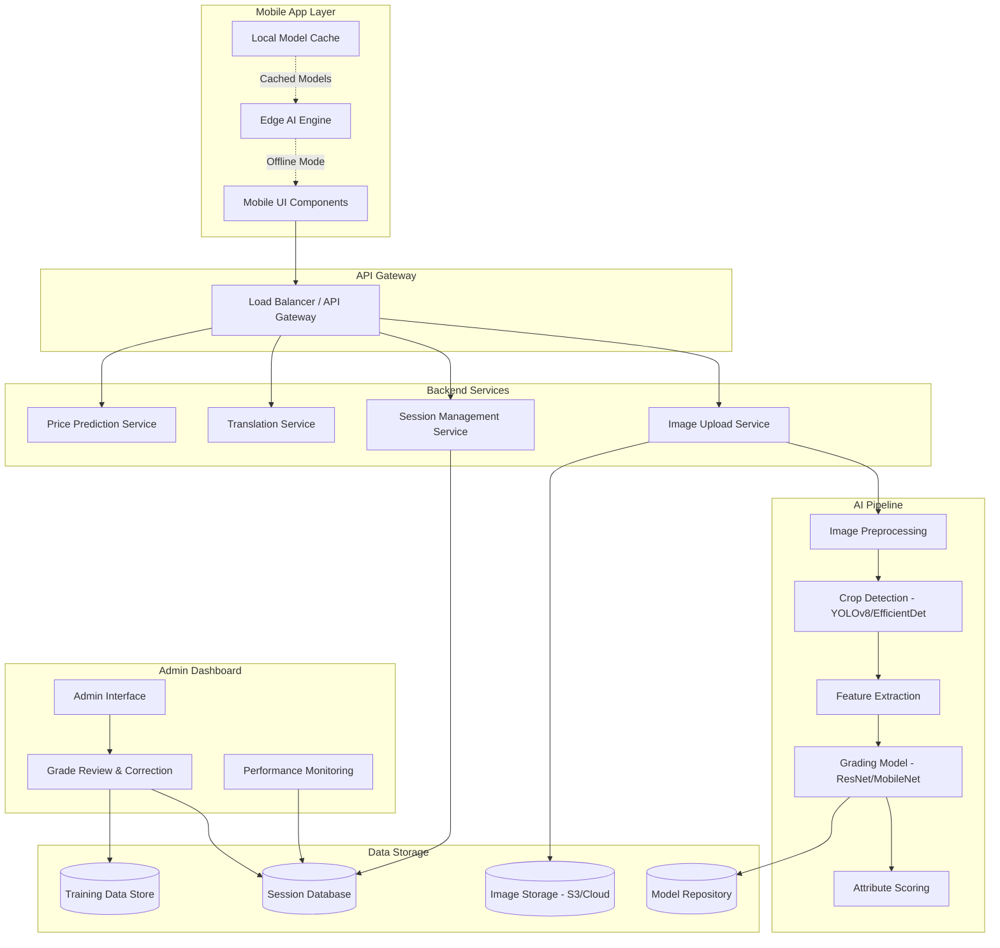
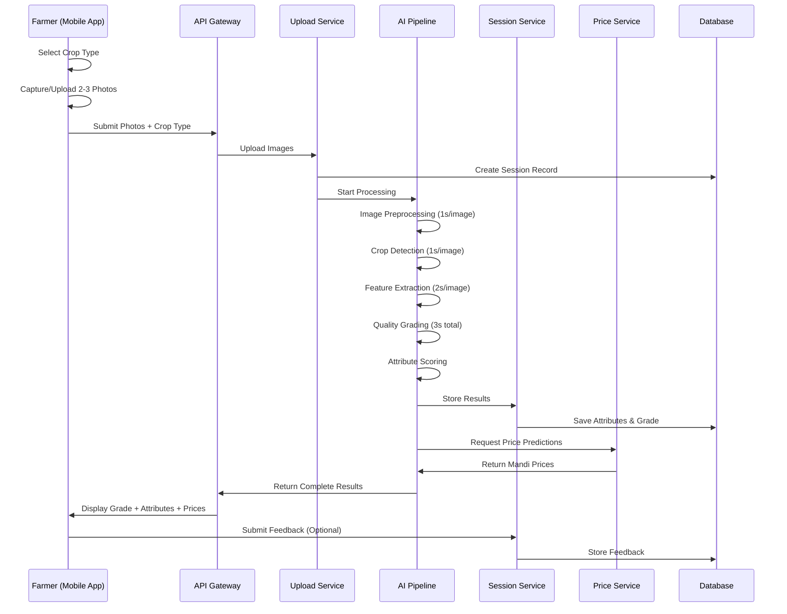
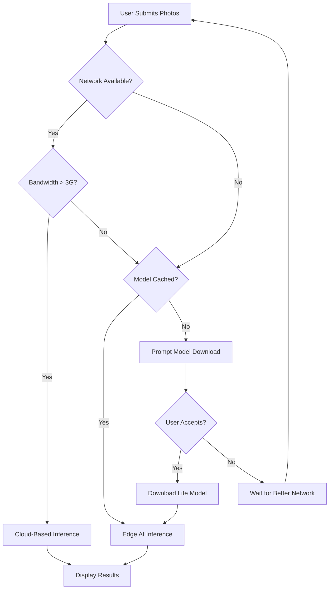
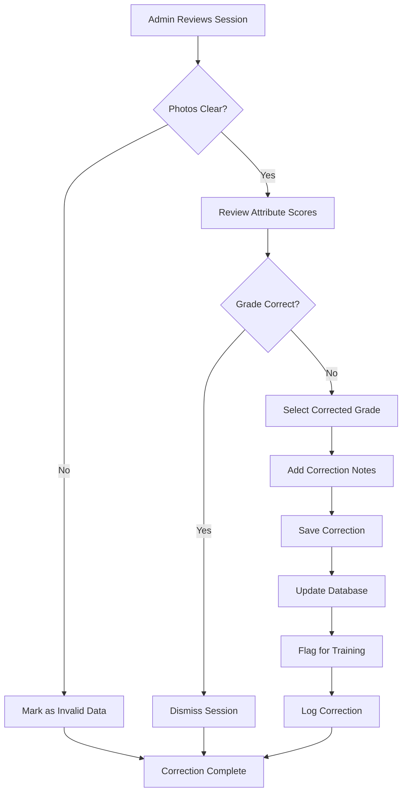

# Design Document: AI Crop Quality Grading

## Overview

The AI Crop Quality Grading system enables farmers to assess crop quality using mobile phone photos. The system analyzes 2-3 uploaded images to determine quality grades (A/B/C), provides comprehensive attribute analysis across 6 categories, displays confidence scores, and integrates with mandi price predictions. The feature supports 8 crop types (Wheat, Tomato, Onion, Chilli, Cardamom, Potato, Rice, Cotton) with crop-specific grading logic, seasonal adjustments, and regional standards.

The system is designed for rural farmers with limited technical literacy and operates efficiently on 3G networks with mobile devices having at least 2GB RAM. It provides multilingual support (Hindi, English, Telugu, Tamil) and uses a simple 3-step workflow: crop selection, photo upload, and results display.

## Architecture

### High-Level System Architecture



### Component Interaction Flow



### Edge AI vs Cloud Inference Decision Logic



## Components and Interfaces

### Frontend Components

#### 1. CropSelector Component

**Purpose:** Displays 8 crop options with icons and text labels for farmer selection.

**Interface:**
```typescript
interface CropSelectorProps {
  onCropSelected: (cropType: CropType) => void;
  language: Language;
}

enum CropType {
  WHEAT = 'wheat',
  TOMATO = 'tomato',
  ONION = 'onion',
  CHILLI = 'chilli',
  CARDAMOM = 'cardamom',
  POTATO = 'potato',
  RICE = 'rice',
  COTTON = 'cotton'
}

enum Language {
  HINDI = 'hi',
  ENGLISH = 'en',
  TELUGU = 'te',
  TAMIL = 'ta'
}
```

**Behavior:**
- Displays 8 crop options in a grid layout (2x4 or 4x2 based on screen orientation)
- Each option shows crop icon (minimum 48x48px) and translated text label
- On selection, triggers onCropSelected callback and navigates to photo capture
- Uses high contrast colors (4.5:1 ratio minimum)
- Plays audio instruction in selected language

#### 2. PhotoCapture Component

**Purpose:** Handles photo capture/upload with guidelines and preview.

**Interface:**
```typescript
interface PhotoCaptureProps {
  cropType: CropType;
  language: Language;
  onPhotosReady: (photos: Photo[]) => void;
  minPhotos: number; // 2
  maxPhotos: number; // 3
}

interface Photo {
  id: string;
  uri: string;
  blob: Blob;
  timestamp: Date;
  source: 'camera' | 'gallery';
}
```

**Behavior:**
- Displays photo guidelines: daylight, plain background, close view
- Provides camera capture and gallery upload buttons (minimum 48x48px)
- Shows preview thumbnails of uploaded photos
- Allows retake/replace functionality
- Validates photo count (2-3 required)
- Compresses images before upload (target: <500KB per image)
- Disables "Analyze" button until minimum photos uploaded

#### 3. ImageQualityValidator Component

**Purpose:** Validates uploaded images meet quality standards.

**Interface:**
```typescript
interface ImageQualityValidatorProps {
  photos: Photo[];
  onValidationComplete: (result: ValidationResult) => void;
}

interface ValidationResult {
  isValid: boolean;
  issues: QualityIssue[];
}

interface QualityIssue {
  photoId: string;
  issueType: 'clarity' | 'lighting' | 'crop_visibility' | 'background';
  message: string;
  severity: 'error' | 'warning';
}
```

**Behavior:**
- Analyzes image clarity using blur detection algorithms
- Checks lighting conditions (not too dark/bright)
- Validates crop visibility in frame
- Checks background simplicity
- Returns specific guidance for failed validations
- Blocks analysis if critical issues found

#### 4. ProcessingAnimation Component

**Purpose:** Displays animated processing indicator during analysis.

**Interface:**
```typescript
interface ProcessingAnimationProps {
  stage: ProcessingStage;
  estimatedTimeRemaining: number; // seconds
  language: Language;
}

enum ProcessingStage {
  UPLOADING = 'uploading',
  PREPROCESSING = 'preprocessing',
  DETECTING = 'detecting',
  EXTRACTING = 'extracting',
  GRADING = 'grading',
  COMPLETE = 'complete'
}
```

**Behavior:**
- Shows animated spinner or progress indicator
- Displays current processing stage in translated text
- Shows estimated time remaining
- Prevents user interaction during processing
- Updates stage as pipeline progresses

#### 5. ResultsDisplay Component

**Purpose:** Displays comprehensive grading results with attribute breakdown.

**Interface:**
```typescript
interface ResultsDisplayProps {
  result: GradingResult;
  language: Language;
  onFeedback: (feedback: Feedback) => void;
}

interface GradingResult {
  sessionId: string;
  cropType: CropType;
  qualityGrade: QualityGrade;
  confidenceScore: number; // 0-100
  attributes: CropAttributes;
  pricePredictions: PricePrediction[];
  recommendations: SellingRecommendation[];
  timestamp: Date;
}

enum QualityGrade {
  A = 'A',
  B = 'B',
  C = 'C'
}
```

**Behavior:**
- Displays quality grade prominently with color coding (A=green, B=yellow, C=red)
- Shows confidence score as percentage with visual indicator
- Organizes attributes by 6 categories with expandable sections
- Displays each attribute with score/rating and visual indicator
- Highlights attributes that most influenced grade
- Shows crop-specific attributes prominently
- Uses farmer-friendly terminology
- Provides audio summary in selected language

#### 6. PricePrediction Component

**Purpose:** Displays mandi price predictions and selling recommendations.

**Interface:**
```typescript
interface PricePredictionProps {
  predictions: PricePrediction[];
  qualityGrade: QualityGrade;
  language: Language;
}

interface PricePrediction {
  mandiName: string;
  location: string;
  pricePerQuintal: number; // INR
  priceDate: Date;
  isHighest: boolean;
}

interface SellingRecommendation {
  message: string;
  timing: 'immediate' | 'wait' | 'monitor';
  reasoning: string;
}
```

**Behavior:**
- Lists mandi prices sorted by highest first
- Highlights best price option
- Shows price date/time
- Displays selling recommendations
- Indicates optimal timing
- Shows regional context

#### 7. FeedbackCollector Component

**Purpose:** Collects farmer feedback on grading accuracy.

**Interface:**
```typescript
interface FeedbackCollectorProps {
  sessionId: string;
  onFeedbackSubmitted: () => void;
}

interface Feedback {
  sessionId: string;
  rating: 'thumbs_up' | 'thumbs_down';
  timestamp: Date;
  farmerId: string;
}
```

**Behavior:**
- Displays thumbs up/down buttons (minimum 48x48px)
- Allows single feedback submission per session
- Shows thank you message after submission
- Disables buttons after feedback given

### Backend Services

#### 1. ImageProcessingService

**Purpose:** Preprocesses uploaded images for AI pipeline.

**Interface:**
```typescript
interface ImageProcessingService {
  preprocessImage(image: Buffer, cropType: CropType): Promise<ProcessedImage>;
  compressImage(image: Buffer, targetSize: number): Promise<Buffer>;
  validateImageQuality(image: Buffer): Promise<ValidationResult>;
}

interface ProcessedImage {
  normalized: Buffer;
  backgroundFiltered: Buffer;
  noiseReduced: Buffer;
  edgeDetected: Buffer;
  dimensions: { width: number; height: number };
  processingTime: number; // milliseconds
}
```

**Operations:**
- Normalize dimensions to standard size (e.g., 640x640)
- Normalize color values (RGB standardization)
- Apply background filtering to isolate crop
- Perform noise reduction (Gaussian blur, median filter)
- Apply edge detection (Canny, Sobel)
- Target: <1 second per image

#### 2. CropDetectionService

**Purpose:** Identifies and localizes crops in preprocessed images.

**Interface:**
```typescript
interface CropDetectionService {
  detectCrops(image: ProcessedImage, cropType: CropType): Promise<DetectionResult>;
  getModelVersion(): string;
}

interface DetectionResult {
  detections: CropDetection[];
  processingTime: number;
  modelVersion: string;
}

interface CropDetection {
  boundingBox: BoundingBox;
  confidence: number;
  cropType: CropType;
}

interface BoundingBox {
  x: number;
  y: number;
  width: number;
  height: number;
}
```

**Operations:**
- Uses YOLOv8 or EfficientDet architecture
- Detects multiple crop samples in single image
- Returns bounding boxes with confidence scores
- Filters detections below confidence threshold (e.g., 0.5)
- Target: <1 second per image

#### 3. FeatureExtractionService

**Purpose:** Extracts comprehensive crop attributes from detected regions.

**Interface:**
```typescript
interface FeatureExtractionService {
  extractFeatures(
    image: ProcessedImage,
    detections: CropDetection[],
    cropType: CropType
  ): Promise<ExtractedFeatures>;
}

interface ExtractedFeatures {
  physicalAttributes: PhysicalAttributes;
  visualQuality: VisualQuality;
  damageAssessment: DamageAssessment;
  freshnessIndicators: FreshnessIndicators;
  contaminationDetection: ContaminationDetection;
  cropSpecificAttributes: CropSpecificAttributes;
  processingTime: number;
}
```

**Operations:**
- Analyzes color histograms for consistency and intensity
- Calculates size distributions across detected samples
- Identifies shape irregularities and deformities
- Detects surface damage, blemishes, bruising
- Identifies disease indicators (spots, rot, mold)
- Estimates freshness based on visual cues
- Detects foreign matter and contamination
- Extracts crop-specific features based on crop type
- Target: <2 seconds per image

#### 4. GradingService

**Purpose:** Assigns quality grades based on extracted features.

**Interface:**
```typescript
interface GradingService {
  gradeQuality(
    features: ExtractedFeatures[],
    cropType: CropType,
    context: GradingContext
  ): Promise<GradingResult>;
  getModelVersion(): string;
}

interface GradingContext {
  season: Season;
  region: Region;
  targetMarket?: string;
}

enum Season {
  PEAK_HARVEST = 'peak_harvest',
  OFF_SEASON = 'off_season',
  STORAGE_PERIOD = 'storage_period'
}

enum Region {
  NORTH_INDIA = 'north_india',
  SOUTH_INDIA = 'south_india',
  WEST_INDIA = 'west_india',
  EAST_INDIA = 'east_india'
}
```

**Operations:**
- Uses CNN architecture (ResNet or MobileNet)
- Aggregates features from multiple images
- Applies crop-specific grading criteria
- Applies attribute weighting based on crop type
- Applies seasonal adjustments
- Applies regional standard adjustments
- Generates confidence score
- Target: <3 seconds total inference time

#### 5. AttributeScoringService

**Purpose:** Calculates individual scores for each attribute category.

**Interface:**
```typescript
interface AttributeScoringService {
  scoreAttributes(
    features: ExtractedFeatures,
    cropType: CropType,
    weights: AttributeWeights
  ): Promise<ScoredAttributes>;
}

interface AttributeWeights {
  physicalAttributes: number;
  visualQuality: number;
  damageAssessment: number;
  freshnessIndicators: number;
  contaminationDetection: number;
  cropSpecificAttributes: number;
}

interface ScoredAttributes {
  physicalAttributesScore: number; // 0-100
  visualQualityScore: number; // 0-100
  damageAssessmentScore: number; // 0-100
  freshnessScore: number; // 0-100
  contaminationScore: number; // 0-100
  cropSpecificScore: number; // 0-100
  overallScore: number; // weighted average
  influentialCategories: string[]; // categories that most influenced grade
}
```

**Operations:**
- Calculates score for each attribute category (0-100)
- Applies crop-specific weights to categories
- Computes weighted overall score
- Identifies most influential categories
- Ensures all scores are within valid range [0, 100]

#### 6. PricePredictionService

**Purpose:** Predicts mandi prices based on quality grade.

**Interface:**
```typescript
interface PricePredictionService {
  predictPrices(
    cropType: CropType,
    qualityGrade: QualityGrade,
    region: Region
  ): Promise<PricePrediction[]>;
  getRecommendations(
    predictions: PricePrediction[],
    qualityGrade: QualityGrade
  ): Promise<SellingRecommendation[]>;
}
```

**Operations:**
- Fetches current mandi prices for crop type
- Applies grade-based pricing factors (A=premium, B=standard, C=discount)
- Returns predictions for 6+ major mandis
- Identifies highest price option
- Generates selling recommendations based on market trends
- Considers seasonal and regional factors

#### 7. TranslationService

**Purpose:** Provides multilingual support for all user-facing text.

**Interface:**
```typescript
interface TranslationService {
  translate(key: string, language: Language, params?: Record<string, any>): string;
  translateAttributes(attributes: CropAttributes, language: Language): TranslatedAttributes;
  getSupportedLanguages(): Language[];
}
```

**Operations:**
- Supports Hindi, English, Telugu, Tamil
- Translates UI labels, messages, guidelines
- Translates attribute names and descriptions
- Translates quality grade descriptors
- Provides context-aware translations
- Caches translations for offline use

## Data Models

### 1. UploadSession Model

```typescript
interface UploadSession {
  sessionId: string;
  farmerId: string;
  cropType: CropType;
  photos: SessionPhoto[];
  status: SessionStatus;
  createdAt: Date;
  updatedAt: Date;
  completedAt?: Date;
  result?: GradingResult;
  feedback?: Feedback;
}

interface SessionPhoto {
  photoId: string;
  uri: string;
  uploadedAt: Date;
  source: 'camera' | 'gallery';
  compressed: boolean;
  originalSize: number; // bytes
  compressedSize: number; // bytes
}

enum SessionStatus {
  CREATED = 'created',
  UPLOADING = 'uploading',
  PROCESSING = 'processing',
  COMPLETED = 'completed',
  FAILED = 'failed'
}
```

### 2. CropAttributes Model

```typescript
interface CropAttributes {
  physicalAttributes: PhysicalAttributes;
  visualQuality: VisualQuality;
  damageAssessment: DamageAssessment;
  freshnessIndicators: FreshnessIndicators;
  contaminationDetection: ContaminationDetection;
  cropSpecificAttributes: CropSpecificAttributes;
}

interface PhysicalAttributes {
  sizeUniformity: number; // 0-100
  shapeRegularity: number; // 0-100
  weightConsistency: number; // 0-100
  textureQuality: 'smooth' | 'rough' | 'mixed';
  firmnessLevel: 'soft' | 'firm' | 'hard';
  maturityLevel: 'under_ripe' | 'ripe' | 'over_ripe';
}

interface VisualQuality {
  colorConsistency: number; // 0-100
  colorIntensity: number; // 0-100
  glossLevel: number; // 0-100
  surfaceBlemishesCount: number;
  discolorationPatterns: string[];
  bruisingIndicators: number; // 0-100
}

interface DamageAssessment {
  physicalDamage: number; // percentage 0-100
  insectDamage: number; // percentage 0-100
  diseaseSymptoms: number; // percentage 0-100
  mechanicalDamage: number; // percentage 0-100
  weatherDamage: number; // percentage 0-100
  storageDamage: number; // percentage 0-100
  totalDamage: number; // percentage 0-100
}

interface FreshnessIndicators {
  moistureContentLevel: number; // 0-100
  wiltingIndicators: number; // 0-100
  stemLeafFreshness: number; // 0-100 (if applicable)
  skinIntegrity: number; // 0-100
  estimatedShelfLife: number; // days
  freshnessScore: number; // 0-100
}

interface ContaminationDetection {
  foreignMatterPresence: number; // percentage 0-100
  pestInfestationSigns: boolean;
  chemicalResidueIndicators: boolean;
  moldFungalGrowth: boolean;
  contaminationLevel: number; // percentage 0-100
}

interface CropSpecificAttributes {
  cropType: CropType;
  attributes: Record<string, any>;
}

// Crop-specific attribute examples:
interface TomatoAttributes {
  firmnessLevel: number;
  colorUniformity: number;
  stemAttachmentQuality: number;
}

interface OnionAttributes {
  bulbSizeConsistency: number;
  skinQuality: number;
  sproutingIndicators: number;
}

interface WheatAttributes {
  grainSizeDistribution: number;
  colorUniformity: number;
  foreignMatterContent: number;
}

interface RiceAttributes {
  grainLengthConsistency: number;
  brokenGrainPercentage: number;
  chalkinessLevel: number;
}

interface PotatoAttributes {
  eyeDepth: number;
  skinQuality: number;
  greeningIndicators: number;
}

interface ChilliAttributes {
  colorIntensity: number;
  dryingLevel: number;
  stemCondition: number;
}

interface CottonAttributes {
  fiberLengthIndicators: number;
  colorPurity: number;
  trashContent: number;
}

interface CardamomAttributes {
  podSizeConsistency: number;
  colorQuality: number;
  oilContentIndicators: number;
}
```

### 3. GradingResult Model

```typescript
interface GradingResult {
  sessionId: string;
  cropType: CropType;
  qualityGrade: QualityGrade;
  confidenceScore: number; // 0-100
  attributes: CropAttributes;
  scoredAttributes: ScoredAttributes;
  pricePredictions: PricePrediction[];
  recommendations: SellingRecommendation[];
  gradingContext: GradingContext;
  modelVersion: string;
  timestamp: Date;
  processingMetrics: ProcessingMetrics;
}

interface ProcessingMetrics {
  preprocessingTime: number; // milliseconds
  detectionTime: number; // milliseconds
  extractionTime: number; // milliseconds
  gradingTime: number; // milliseconds
  totalTime: number; // milliseconds
}
```

### 4. PricePrediction Model

```typescript
interface PricePrediction {
  mandiId: string;
  mandiName: string;
  location: string;
  region: Region;
  pricePerQuintal: number; // INR
  priceDate: Date;
  qualityGrade: QualityGrade;
  isHighest: boolean;
  priceTrend: 'rising' | 'falling' | 'stable';
  historicalAverage: number; // INR
}
```

### 5. FeedbackData Model

```typescript
interface FeedbackData {
  feedbackId: string;
  sessionId: string;
  farmerId: string;
  rating: 'thumbs_up' | 'thumbs_down';
  timestamp: Date;
  gradingResult: GradingResult;
  flaggedForReview: boolean;
}
```

### 6. TrainingData Model

```typescript
interface TrainingData {
  trainingId: string;
  sessionId: string;
  images: string[]; // URIs
  cropType: CropType;
  originalGrade: QualityGrade;
  correctedGrade?: QualityGrade;
  correctedBy?: string; // admin ID
  correctedAt?: Date;
  attributes: CropAttributes;
  marketClassification: string;
  source: 'university' | 'mandi_board' | 'open_dataset' | 'farmer_contribution';
  verified: boolean;
  usedInTraining: boolean;
}
```

### 7. AttributeWeightConfig Model

```typescript
interface AttributeWeightConfig {
  cropType: CropType;
  weights: AttributeWeights;
  season?: Season;
  region?: Region;
  version: string;
  createdAt: Date;
  updatedAt: Date;
}
```

### 8. QualityThresholdConfig Model

```typescript
interface QualityThresholdConfig {
  cropType: CropType;
  gradeA: GradeThresholds;
  gradeB: GradeThresholds;
  gradeC: GradeThresholds;
  season?: Season;
  region?: Region;
  version: string;
}

interface GradeThresholds {
  sizeUniformityMin: number;
  colorConsistencyMin: number;
  physicalDamageMax: number;
  diseaseIndicatorsMax: number;
  freshnessScoreMin: number;
  foreignMatterMax: number;
  overallScoreMin: number;
}
```


## AI Model Pipeline Design

### Image Preprocessing Pipeline

**Stage 1: Image Normalization**
- Resize images to standard dimensions (640x640 pixels)
- Normalize RGB values to [0, 1] range
- Apply color space conversion (RGB to LAB for better color analysis)
- Standardize aspect ratio with padding if needed

**Stage 2: Background Filtering**
- Apply GrabCut algorithm or U-Net segmentation to isolate crop from background
- Use color-based thresholding for simple backgrounds
- Generate binary mask for crop region
- Apply morphological operations (erosion, dilation) to refine mask

**Stage 3: Noise Reduction**
- Apply Gaussian blur (kernel size 3x3 or 5x5)
- Use bilateral filtering to preserve edges while reducing noise
- Apply median filter for salt-and-pepper noise
- Adaptive denoising based on image quality assessment

**Stage 4: Edge Detection**
- Apply Canny edge detection for boundary identification
- Use Sobel operator for gradient-based edge detection
- Combine edge maps for robust boundary detection
- Use edges for shape analysis and defect detection

**Performance Target:** <1 second per image

### Crop Detection Model

**Architecture:** YOLOv8 or EfficientDet

**YOLOv8 Configuration:**
- Model variant: YOLOv8n (nano) for mobile, YOLOv8m (medium) for cloud
- Input size: 640x640
- Confidence threshold: 0.5
- NMS threshold: 0.45
- Classes: 8 crop types

**EfficientDet Configuration:**
- Model variant: EfficientDet-D0 for mobile, EfficientDet-D2 for cloud
- Input size: 512x512
- Confidence threshold: 0.5
- Classes: 8 crop types

**Training Data Requirements:**
- Minimum 1,000 images per crop type
- Diverse lighting conditions (daylight, shade, indoor)
- Various backgrounds (plain, complex, natural)
- Multiple angles and distances
- Annotated bounding boxes for all crop samples

**Output:**
- Bounding boxes for detected crops
- Confidence scores per detection
- Crop type classification (if multi-crop detection enabled)

**Performance Target:** <1 second per image

### Feature Extraction Pipeline

**Color Analysis:**
- Extract color histograms (RGB, HSV, LAB)
- Calculate color consistency using standard deviation
- Measure color intensity using mean values
- Detect discoloration patterns using clustering
- Assess gloss level using specular reflection analysis

**Size and Shape Analysis:**
- Measure bounding box dimensions for each detected crop
- Calculate size distribution statistics (mean, std dev, coefficient of variation)
- Analyze shape using contour analysis
- Calculate circularity, aspect ratio, solidity
- Detect deformities using shape descriptors

**Texture Analysis:**
- Apply Gabor filters for texture feature extraction
- Use Local Binary Patterns (LBP) for texture classification
- Calculate texture smoothness using gradient magnitude
- Assess firmness indicators using texture patterns

**Damage Detection:**
- Use semantic segmentation to identify damaged regions
- Apply color-based detection for disease symptoms (brown spots, rot)
- Use edge detection for physical damage (cuts, cracks)
- Detect insect damage using pattern recognition
- Calculate damage percentage as ratio of damaged to total area

**Freshness Assessment:**
- Analyze color vibrancy for freshness indicators
- Detect wilting using shape deformation analysis
- Assess moisture content using texture and color features
- Evaluate stem/leaf condition using color and texture
- Estimate shelf life using regression model trained on freshness features

**Contamination Detection:**
- Use object detection for foreign matter (stones, debris)
- Apply color-based detection for mold and fungal growth
- Detect pest infestation using pattern recognition
- Identify chemical residue using spectral analysis (if available)

**Crop-Specific Feature Extraction:**
- Tomato: Firmness (texture), stem attachment (object detection), color uniformity
- Onion: Bulb size (dimension analysis), skin quality (texture), sprouting (color/shape)
- Wheat: Grain size (particle analysis), foreign matter (object detection)
- Rice: Grain length (dimension analysis), broken grains (object detection), chalkiness (color)
- Potato: Eye depth (texture analysis), greening (color detection)
- Chilli: Color intensity (color analysis), drying level (texture/color)
- Cotton: Fiber length (texture analysis), trash content (object detection)
- Cardamom: Pod size (dimension analysis), color quality (color analysis)

**Performance Target:** <2 seconds per image

### CNN-Based Grading Model

**Architecture Options:**

**Option 1: ResNet-50 (Cloud Inference)**
- Pre-trained on ImageNet
- Fine-tuned on crop quality dataset
- Input: 224x224 RGB images + extracted features
- Output: 3 classes (A, B, C) + confidence scores
- Additional regression head for attribute scores

**Option 2: MobileNetV3 (Edge AI)**
- Lightweight architecture for mobile deployment
- Pre-trained on ImageNet
- Fine-tuned on crop quality dataset
- Input: 224x224 RGB images + extracted features
- Output: 3 classes (A, B, C) + confidence scores
- Quantized to INT8 for faster inference

**Model Architecture:**
```
Input Layer (224x224x3 + feature vector)
    ↓
Backbone (ResNet-50 or MobileNetV3)
    ↓
Feature Fusion Layer (concatenate CNN features + extracted features)
    ↓
Fully Connected Layers (512 → 256 → 128)
    ↓
Dropout (0.5)
    ↓
Classification Head (3 classes: A, B, C)
    ↓
Confidence Score (softmax probabilities)
    ↓
Attribute Scoring Heads (6 regression outputs for attribute categories)
```

**Training Strategy:**
- Loss function: Weighted cross-entropy for classification + MSE for attribute regression
- Optimizer: Adam with learning rate 0.001
- Batch size: 32 (cloud), 16 (mobile)
- Data augmentation: rotation, flip, brightness, contrast, crop
- Class balancing: weighted sampling or focal loss
- Validation split: 80/20 train/validation
- Early stopping based on validation loss

**Crop-Specific Models:**
- Separate model for each crop type OR
- Single multi-task model with crop-type conditioning
- Crop-specific fine-tuning layers

**Performance Target:** <3 seconds total inference time

### Confidence Scoring Mechanism

**Confidence Score Calculation:**
```
confidence_score = (
    model_confidence * 0.4 +
    feature_quality_score * 0.3 +
    detection_confidence * 0.2 +
    image_quality_score * 0.1
) * 100
```

**Components:**
- **Model Confidence:** Softmax probability of predicted class
- **Feature Quality Score:** Average confidence of extracted features (0-1)
- **Detection Confidence:** Average confidence of crop detections (0-1)
- **Image Quality Score:** Image clarity, lighting, crop visibility (0-1)

**Threshold Handling:**
- Confidence < 70%: Display "Image quality low" message, prompt retake
- Confidence 70-85%: Display results with moderate confidence indicator
- Confidence > 85%: Display results with high confidence indicator

**Uncertainty Quantification:**
- Use Monte Carlo dropout for uncertainty estimation
- Run multiple forward passes with dropout enabled
- Calculate variance of predictions as uncertainty measure
- Higher variance → lower confidence

## Mobile Optimization Strategy

### Image Compression

**Compression Pipeline:**
1. **Client-Side Compression:**
   - Resize to maximum 1024x1024 before upload
   - Apply JPEG compression with quality 85
   - Target: <500KB per image
   - Use progressive JPEG for better perceived loading

2. **Server-Side Compression:**
   - Further resize to model input size (640x640 or 224x224)
   - Apply lossless compression for storage
   - Generate thumbnails for history view

**Compression Algorithms:**
- JPEG for photos (lossy, good for natural images)
- WebP for better compression ratio (if supported)
- PNG for images requiring lossless compression

### Edge AI Model Deployment

**Model Optimization:**
1. **Quantization:**
   - Convert FP32 model to INT8 using post-training quantization
   - Reduces model size by 4x
   - Minimal accuracy loss (<2%)

2. **Pruning:**
   - Remove redundant weights and connections
   - Reduces model size by 30-50%
   - Maintain accuracy within 1% of original

3. **Knowledge Distillation:**
   - Train smaller student model to mimic larger teacher model
   - Achieves similar accuracy with 5-10x fewer parameters

**Deployment Formats:**
- **TensorFlow Lite:** For Android devices
- **Core ML:** For iOS devices
- **ONNX Runtime:** Cross-platform option

**Model Variants:**
- **Lite Model:** MobileNetV3 + quantization (5-10 MB)
- **Standard Model:** ResNet-50 (100-200 MB, cloud only)

### Caching Strategy

**Model Caching:**
- Cache lite model on device after first download
- Store in app's persistent storage
- Check for model updates on app launch (background)
- Update model only on WiFi connection

**Data Caching:**
- Cache translation files for offline use
- Cache crop-specific grading criteria
- Cache attribute weight configurations
- Cache recent session results (last 20)

**Cache Invalidation:**
- Model cache: Check version on server, update if newer
- Translation cache: Update on language change or app update
- Session cache: Clear after 30 days or when storage limit reached

### Offline Capability Design

**Offline Mode Features:**
1. **Crop Selection:** Fully offline (cached UI)
2. **Photo Capture:** Fully offline (native camera)
3. **Image Quality Validation:** Offline using lite model
4. **Grading:** Offline using cached lite model
5. **Price Predictions:** Requires online (show cached prices with timestamp)
6. **Feedback Submission:** Queue for sync when online

**Sync Strategy:**
- Queue offline sessions for upload when online
- Sync in background when WiFi available
- Prioritize feedback and session data
- Retry failed uploads with exponential backoff

**Offline Indicators:**
- Display offline mode badge
- Show last sync timestamp
- Indicate which features require online connection
- Prompt to connect for price predictions

### 3G Network Optimization

**Network Optimization Techniques:**
1. **Progressive Loading:**
   - Load critical UI first
   - Lazy load non-essential components
   - Stream results as they become available

2. **Request Optimization:**
   - Batch multiple requests when possible
   - Use HTTP/2 for multiplexing
   - Compress request/response payloads (gzip)

3. **Adaptive Quality:**
   - Reduce image quality on slow networks
   - Use lower resolution models on slow networks
   - Adjust timeout thresholds based on network speed

4. **Prefetching:**
   - Prefetch translation files on WiFi
   - Prefetch model updates on WiFi
   - Prefetch price data for common crops

**Performance Targets:**
- Total inference time: <3 seconds on 3G
- Image upload: <2 seconds per image on 3G
- Results display: <1 second after inference complete

**Network Monitoring:**
- Detect network type (WiFi, 4G, 3G, 2G)
- Measure network speed and latency
- Adapt behavior based on network conditions
- Display network status indicator

## Crop-Specific Grading Logic

### Wheat Grading Criteria

**Grade A Thresholds:**
- Grain size uniformity: >85%
- Color uniformity: >85% (golden yellow)
- Foreign matter: <1%
- Broken grains: <2%
- Moisture content: 12-14%
- Test weight: >78 kg/hl
- Shriveled grains: <3%

**Grade B Thresholds:**
- Grain size uniformity: 60-85%
- Color uniformity: 60-85%
- Foreign matter: 1-3%
- Broken grains: 2-6%
- Moisture content: 14-16%
- Test weight: 75-78 kg/hl
- Shriveled grains: 3-6%

**Grade C Thresholds:**
- Grain size uniformity: <60%
- Color uniformity: <60%
- Foreign matter: >3%
- Broken grains: >6%
- Moisture content: >16%
- Test weight: <75 kg/hl
- Shriveled grains: >6%

**Attribute Weights:**
- Physical Attributes: 30%
- Visual Quality: 20%
- Contamination Detection: 30%
- Damage Assessment: 15%
- Freshness Indicators: 5%

### Tomato Grading Criteria

**Grade A Thresholds:**
- Size uniformity: >85%
- Color consistency: >85% (deep red)
- Firmness: Firm (7-9 on scale)
- Surface blemishes: <5%
- Bruising: <2%
- Stem attachment: Intact
- Freshness score: >90%
- Shelf life: >7 days

**Grade B Thresholds:**
- Size uniformity: 60-85%
- Color consistency: 60-85%
- Firmness: Moderately firm (5-7)
- Surface blemishes: 5-15%
- Bruising: 2-10%
- Stem attachment: Mostly intact
- Freshness score: 70-90%
- Shelf life: 4-7 days

**Grade C Thresholds:**
- Size uniformity: <60%
- Color consistency: <60%
- Firmness: Soft (<5)
- Surface blemishes: >15%
- Bruising: >10%
- Stem attachment: Missing/damaged
- Freshness score: <70%
- Shelf life: <4 days

**Attribute Weights:**
- Visual Quality: 30%
- Freshness Indicators: 30%
- Physical Attributes: 20%
- Damage Assessment: 15%
- Contamination Detection: 5%

### Onion Grading Criteria

**Grade A Thresholds:**
- Bulb size consistency: >85%
- Skin quality: Tight, dry, intact
- Color uniformity: >85%
- Sprouting: None
- Neck thickness: Thin, well-dried
- Shape regularity: >85%
- Freshness score: >90%

**Grade B Thresholds:**
- Bulb size consistency: 60-85%
- Skin quality: Mostly intact, slight looseness
- Color uniformity: 60-85%
- Sprouting: Minimal (<5%)
- Neck thickness: Moderate
- Shape regularity: 60-85%
- Freshness score: 70-90%

**Grade C Thresholds:**
- Bulb size consistency: <60%
- Skin quality: Loose, damaged
- Color uniformity: <60%
- Sprouting: Significant (>5%)
- Neck thickness: Thick, not dried
- Shape regularity: <60%
- Freshness score: <70%

**Attribute Weights:**
- Physical Attributes: 30%
- Freshness Indicators: 25%
- Visual Quality: 20%
- Crop-Specific Attributes: 15%
- Damage Assessment: 10%

### Chilli Grading Criteria

**Grade A Thresholds:**
- Color intensity: >85% (deep red)
- Drying level: 90-95% (optimal)
- Size uniformity: >85%
- Stem condition: Intact, green
- Surface quality: Smooth, glossy
- Wrinkles: Minimal
- Mold/fungus: None

**Grade B Thresholds:**
- Color intensity: 60-85%
- Drying level: 85-90% or 95-98%
- Size uniformity: 60-85%
- Stem condition: Mostly intact
- Surface quality: Moderate gloss
- Wrinkles: Moderate
- Mold/fungus: <2%

**Grade C Thresholds:**
- Color intensity: <60%
- Drying level: <85% or >98%
- Size uniformity: <60%
- Stem condition: Missing/damaged
- Surface quality: Dull, rough
- Wrinkles: Excessive
- Mold/fungus: >2%

**Attribute Weights:**
- Visual Quality: 35%
- Crop-Specific Attributes: 25%
- Physical Attributes: 20%
- Contamination Detection: 15%
- Damage Assessment: 5%

### Cardamom Grading Criteria

**Grade A Thresholds:**
- Pod size consistency: >85%
- Color quality: >85% (green/bold)
- Pod integrity: Intact, closed
- Oil content indicators: High (aroma)
- Moisture content: 10-12%
- Foreign matter: <1%
- Split pods: <2%

**Grade B Thresholds:**
- Pod size consistency: 60-85%
- Color quality: 60-85%
- Pod integrity: Mostly intact
- Oil content indicators: Moderate
- Moisture content: 12-14%
- Foreign matter: 1-3%
- Split pods: 2-5%

**Grade C Thresholds:**
- Pod size consistency: <60%
- Color quality: <60%
- Pod integrity: Split, open
- Oil content indicators: Low
- Moisture content: >14%
- Foreign matter: >3%
- Split pods: >5%

**Attribute Weights:**
- Crop-Specific Attributes: 35%
- Visual Quality: 25%
- Physical Attributes: 20%
- Contamination Detection: 15%
- Freshness Indicators: 5%

### Potato Grading Criteria

**Grade A Thresholds:**
- Size uniformity: >85%
- Skin quality: Smooth, intact
- Eye depth: Shallow
- Shape regularity: >85%
- Greening: None
- Mechanical damage: <5%
- Disease symptoms: <2%

**Grade B Thresholds:**
- Size uniformity: 60-85%
- Skin quality: Minor blemishes
- Eye depth: Moderate
- Shape regularity: 60-85%
- Greening: <5%
- Mechanical damage: 5-15%
- Disease symptoms: 2-10%

**Grade C Thresholds:**
- Size uniformity: <60%
- Skin quality: Rough, damaged
- Eye depth: Deep
- Shape regularity: <60%
- Greening: >5%
- Mechanical damage: >15%
- Disease symptoms: >10%

**Attribute Weights:**
- Physical Attributes: 30%
- Damage Assessment: 25%
- Crop-Specific Attributes: 20%
- Visual Quality: 15%
- Contamination Detection: 10%

### Rice Grading Criteria

**Grade A Thresholds:**
- Grain length consistency: >85%
- Broken grain percentage: <5%
- Chalkiness level: <5%
- Color uniformity: >85% (white/translucent)
- Foreign matter: <1%
- Damaged grains: <2%
- Moisture content: 12-14%

**Grade B Thresholds:**
- Grain length consistency: 60-85%
- Broken grain percentage: 5-15%
- Chalkiness level: 5-15%
- Color uniformity: 60-85%
- Foreign matter: 1-3%
- Damaged grains: 2-6%
- Moisture content: 14-16%

**Grade C Thresholds:**
- Grain length consistency: <60%
- Broken grain percentage: >15%
- Chalkiness level: >15%
- Color uniformity: <60%
- Foreign matter: >3%
- Damaged grains: >6%
- Moisture content: >16%

**Attribute Weights:**
- Physical Attributes: 35%
- Crop-Specific Attributes: 25%
- Contamination Detection: 20%
- Damage Assessment: 15%
- Visual Quality: 5%

### Cotton Grading Criteria

**Grade A Thresholds:**
- Fiber length indicators: >85% (long staple)
- Color purity: >85% (white/cream)
- Trash content: <2%
- Moisture content: 7-8%
- Fiber strength: High
- Maturity: >85%
- Staining: None

**Grade B Thresholds:**
- Fiber length indicators: 60-85%
- Color purity: 60-85%
- Trash content: 2-5%
- Moisture content: 8-10%
- Fiber strength: Moderate
- Maturity: 60-85%
- Staining: <5%

**Grade C Thresholds:**
- Fiber length indicators: <60%
- Color purity: <60%
- Trash content: >5%
- Moisture content: >10%
- Fiber strength: Low
- Maturity: <60%
- Staining: >5%

**Attribute Weights:**
- Crop-Specific Attributes: 40%
- Contamination Detection: 25%
- Physical Attributes: 20%
- Visual Quality: 10%
- Damage Assessment: 5%

### Attribute Weighting Matrices

```typescript
const ATTRIBUTE_WEIGHTS: Record<CropType, AttributeWeights> = {
  wheat: {
    physicalAttributes: 0.30,
    visualQuality: 0.20,
    damageAssessment: 0.15,
    freshnessIndicators: 0.05,
    contaminationDetection: 0.30,
    cropSpecificAttributes: 0.00
  },
  tomato: {
    physicalAttributes: 0.20,
    visualQuality: 0.30,
    damageAssessment: 0.15,
    freshnessIndicators: 0.30,
    contaminationDetection: 0.05,
    cropSpecificAttributes: 0.00
  },
  onion: {
    physicalAttributes: 0.30,
    visualQuality: 0.20,
    damageAssessment: 0.10,
    freshnessIndicators: 0.25,
    contaminationDetection: 0.00,
    cropSpecificAttributes: 0.15
  },
  chilli: {
    physicalAttributes: 0.20,
    visualQuality: 0.35,
    damageAssessment: 0.05,
    freshnessIndicators: 0.00,
    contaminationDetection: 0.15,
    cropSpecificAttributes: 0.25
  },
  cardamom: {
    physicalAttributes: 0.20,
    visualQuality: 0.25,
    damageAssessment: 0.00,
    freshnessIndicators: 0.05,
    contaminationDetection: 0.15,
    cropSpecificAttributes: 0.35
  },
  potato: {
    physicalAttributes: 0.30,
    visualQuality: 0.15,
    damageAssessment: 0.25,
    freshnessIndicators: 0.00,
    contaminationDetection: 0.10,
    cropSpecificAttributes: 0.20
  },
  rice: {
    physicalAttributes: 0.35,
    visualQuality: 0.05,
    damageAssessment: 0.15,
    freshnessIndicators: 0.00,
    contaminationDetection: 0.20,
    cropSpecificAttributes: 0.25
  },
  cotton: {
    physicalAttributes: 0.20,
    visualQuality: 0.10,
    damageAssessment: 0.05,
    freshnessIndicators: 0.00,
    contaminationDetection: 0.25,
    cropSpecificAttributes: 0.40
  }
};
```

### Seasonal Adjustment Algorithms

**Peak Harvest Season Adjustments:**
- Increase quality thresholds by 5-10%
- Apply stricter freshness requirements
- Reduce tolerance for damage and contamination
- Expect optimal maturity levels

**Off-Season Adjustments:**
- Decrease quality thresholds by 5-10%
- Relax freshness requirements (storage expected)
- Increase tolerance for minor damage
- Adjust maturity expectations

**Storage Period Adjustments:**
- Focus on storage damage indicators
- Adjust shelf life estimates downward
- Increase weight on contamination detection
- Reduce emphasis on freshness indicators

**Implementation:**
```typescript
function applySeasonalAdjustment(
  thresholds: GradeThresholds,
  season: Season,
  cropType: CropType
): GradeThresholds {
  const adjustmentFactor = getSeasonalAdjustmentFactor(season, cropType);
  
  return {
    sizeUniformityMin: thresholds.sizeUniformityMin * adjustmentFactor,
    colorConsistencyMin: thresholds.colorConsistencyMin * adjustmentFactor,
    physicalDamageMax: thresholds.physicalDamageMax / adjustmentFactor,
    diseaseIndicatorsMax: thresholds.diseaseIndicatorsMax / adjustmentFactor,
    freshnessScoreMin: thresholds.freshnessScoreMin * adjustmentFactor,
    foreignMatterMax: thresholds.foreignMatterMax / adjustmentFactor,
    overallScoreMin: thresholds.overallScoreMin * adjustmentFactor
  };
}

function getSeasonalAdjustmentFactor(season: Season, cropType: CropType): number {
  const factors = {
    peak_harvest: 1.05,  // 5% stricter
    off_season: 0.95,    // 5% more lenient
    storage_period: 0.90 // 10% more lenient
  };
  return factors[season];
}
```

### Regional Standard Configurations

**North India Standards:**
- Emphasis on grain crops (wheat, rice)
- Stricter contamination thresholds
- Higher moisture content tolerance for certain crops
- Specific color preferences (e.g., golden wheat)

**South India Standards:**
- Emphasis on spices (cardamom, chilli)
- Stricter freshness requirements for vegetables
- Higher tolerance for size variation in certain crops
- Specific maturity preferences

**West India Standards:**
- Emphasis on cotton and onion
- Stricter fiber quality for cotton
- Higher tolerance for storage indicators
- Specific color preferences for onions

**East India Standards:**
- Emphasis on rice and vegetables
- Stricter grain quality for rice
- Higher freshness requirements
- Specific size preferences

**Implementation:**
```typescript
const REGIONAL_ADJUSTMENTS: Record<Region, Record<CropType, Partial<GradeThresholds>>> = {
  north_india: {
    wheat: {
      colorConsistencyMin: 88, // Prefer golden color
      foreignMatterMax: 0.8    // Stricter contamination
    },
    rice: {
      sizeUniformityMin: 88,
      foreignMatterMax: 0.8
    }
    // ... other crops
  },
  south_india: {
    cardamom: {
      freshnessScoreMin: 92,   // Stricter freshness
      colorConsistencyMin: 88  // Prefer bold green
    },
    chilli: {
      colorConsistencyMin: 88, // Prefer deep red
      freshnessScoreMin: 85
    }
    // ... other crops
  },
  // ... other regions
};
```


## UI/UX Design Patterns

### 3-Step Workflow Screens

**Step 1: Crop Selection Screen**
```
┌─────────────────────────────────┐
│  [Language: हिंदी ▼]  [Help ?]  │
├─────────────────────────────────┤
│                                 │
│   अपनी फसल चुनें                │
│   (Select Your Crop)            │
│                                 │
│  ┌──────┐  ┌──────┐  ┌──────┐  │
│  │ 🌾   │  │ 🍅   │  │ 🧅   │  │
│  │ गेहूं │  │टमाटर │  │ प्याज│  │
│  └──────┘  └──────┘  └──────┘  │
│                                 │
│  ┌──────┐  ┌──────┐  ┌──────┐  │
│  │ 🌶️   │  │ 🫚   │  │ 🥔   │  │
│  │ मिर्च│  │इलायची│  │ आलू  │  │
│  └──────┘  └──────┘  └──────┘  │
│                                 │
│  ┌──────┐  ┌──────┐            │
│  │ 🌾   │  │ 🌱   │            │
│  │ चावल│  │ कपास │            │
│  └──────┘  └──────┘            │
│                                 │
│  [🔊 सुनें]                     │
│                                 │
│  Progress: ● ○ ○                │
└─────────────────────────────────┘
```

**Step 2: Photo Upload Screen**
```
┌─────────────────────────────────┐
│  [← Back]         [Help ?]      │
├─────────────────────────────────┤
│                                 │
│   फोटो लें (Take Photos)        │
│   2-3 फोटो चाहिए                │
│                                 │
│  📸 फोटो लेने के निर्देश:       │
│  ✓ दिन की रोशनी में             │
│  ✓ सादा पृष्ठभूमि               │
│  ✓ पास से फोटो लें              │
│                                 │
│  ┌─────────┐  ┌─────────┐      │
│  │ Photo 1 │  │ Photo 2 │      │
│  │  [✓]    │  │  [✓]    │      │
│  └─────────┘  └─────────┘      │
│                                 │
│  ┌─────────┐                    │
│  │   [+]   │                    │
│  │ Add     │                    │
│  └─────────┘                    │
│                                 │
│  ┌─────────────────────────┐   │
│  │  📷 कैमरा  │  📁 गैलरी  │   │
│  └─────────────────────────┘   │
│                                 │
│  ┌─────────────────────────┐   │
│  │   ✓ विश्लेषण करें        │   │
│  └─────────────────────────┘   │
│                                 │
│  [🔊 सुनें]                     │
│  Progress: ○ ● ○                │
└─────────────────────────────────┘
```

**Step 3: Results Screen**
```
┌─────────────────────────────────┐
│  [← Back]  [📥 Save]  [Share]   │
├─────────────────────────────────┤
│                                 │
│   गुणवत्ता ग्रेड (Quality)      │
│                                 │
│        ┌─────────┐              │
│        │    A    │              │
│        │  उत्तम  │              │
│        └─────────┘              │
│                                 │
│   विश्वास: 87% ████████░░       │
│                                 │
│  📊 विस्तृत विश्लेषण:           │
│                                 │
│  ▼ भौतिक गुण (92%)             │
│    • आकार एकरूपता: 90%         │
│    • आकृति नियमितता: 88%       │
│    • परिपक्वता: पका हुआ        │
│                                 │
│  ▼ दृश्य गुणवत्ता (85%)        │
│    • रंग स्थिरता: 87%          │
│    • चमक स्तर: 82%             │
│    • सतह दोष: 3%               │
│                                 │
│  ▼ ताजगी संकेतक (94%)          │
│    • नमी स्तर: उच्च            │
│    • शेल्फ लाइफ: 8 दिन         │
│                                 │
│  💰 मंडी मूल्य अनुमान:          │
│  🏆 हैदराबाद: ₹2,850/क्विंटल   │
│     नागपुर: ₹2,720/क्विंटल     │
│     दिल्ली: ₹2,680/क्विंटल     │
│                                 │
│  💡 सिफारिश: हैदराबाद मंडी में │
│     बेचें - सर्वोत्तम मूल्य    │
│                                 │
│  क्या यह सही है?               │
│  [👍 हाँ]  [👎 नहीं]           │
│                                 │
│  Progress: ○ ○ ●                │
└─────────────────────────────────┘
```

### Farmer-Friendly Interface Guidelines

**Visual Design Principles:**
1. **Large Touch Targets:** Minimum 48x48 pixels for all interactive elements
2. **High Contrast:** 4.5:1 ratio minimum for text and backgrounds
3. **Simple Icons:** Use universally recognizable crop icons and symbols
4. **Color Coding:** Green (A), Yellow (B), Red (C) for grades
5. **Minimal Text:** Use icons and visuals wherever possible
6. **Clear Hierarchy:** Most important information (grade) displayed prominently

**Typography:**
- Font size: Minimum 16px for body text, 24px+ for headings
- Font family: System fonts with good Indic script support (Noto Sans, Roboto)
- Line height: 1.5 for better readability
- Font weight: Bold for important information

**Layout:**
- Single column layout for mobile
- Generous padding and spacing (16-24px)
- Sticky header with navigation
- Bottom navigation for primary actions
- Scrollable content with clear sections

**Interaction Patterns:**
- Tap to select (no hover states needed)
- Swipe to navigate between photos
- Pull to refresh for price updates
- Long press for additional options
- Haptic feedback for confirmations

### Multilingual UI Components

**Language Selector Component:**
```typescript
interface LanguageSelectorProps {
  currentLanguage: Language;
  onLanguageChange: (language: Language) => void;
}

const languages = [
  { code: 'hi', name: 'हिंदी', nativeName: 'हिंदी' },
  { code: 'en', name: 'English', nativeName: 'English' },
  { code: 'te', name: 'Telugu', nativeName: 'తెలుగు' },
  { code: 'ta', name: 'Tamil', nativeName: 'தமிழ்' }
];
```

**Translation Keys Structure:**
```json
{
  "crop_selection": {
    "title": "Select Your Crop",
    "wheat": "Wheat",
    "tomato": "Tomato",
    "onion": "Onion",
    "chilli": "Chilli",
    "cardamom": "Cardamom",
    "potato": "Potato",
    "rice": "Rice",
    "cotton": "Cotton"
  },
  "photo_capture": {
    "title": "Take Photos",
    "guidelines_title": "Photo Guidelines",
    "guideline_daylight": "Capture in daylight",
    "guideline_background": "Use plain background",
    "guideline_closeup": "Take close view shots",
    "min_photos": "Need 2-3 photos",
    "camera_button": "Camera",
    "gallery_button": "Gallery",
    "analyze_button": "Analyze"
  },
  "results": {
    "title": "Quality Grade",
    "confidence": "Confidence",
    "detailed_analysis": "Detailed Analysis",
    "grade_a": "Excellent",
    "grade_b": "Good",
    "grade_c": "Fair",
    "physical_attributes": "Physical Attributes",
    "visual_quality": "Visual Quality",
    "damage_assessment": "Damage Assessment",
    "freshness_indicators": "Freshness Indicators",
    "contamination_detection": "Contamination Detection",
    "crop_specific": "Crop-Specific Attributes",
    "price_predictions": "Mandi Price Predictions",
    "recommendations": "Selling Recommendations",
    "feedback_question": "Is this correct?",
    "feedback_yes": "Yes",
    "feedback_no": "No"
  },
  "attributes": {
    "size_uniformity": "Size Uniformity",
    "shape_regularity": "Shape Regularity",
    "color_consistency": "Color Consistency",
    "freshness_score": "Freshness Score",
    "shelf_life": "Shelf Life",
    "damage_percentage": "Damage Percentage"
  },
  "errors": {
    "network_error": "Network error. Please check your connection and try again.",
    "upload_failed": "Photo upload failed. Please try again.",
    "no_crop_detected": "No crop detected. Please take clearer photos following the guidelines.",
    "low_confidence": "Image quality low. Please upload better quality photos.",
    "processing_error": "Processing error. Please try again later."
  }
}
```

**Right-to-Left (RTL) Support:**
- Detect language direction (LTR for English, Hindi, Telugu, Tamil)
- Mirror layout for RTL languages if needed in future (Urdu, Arabic)
- Adjust text alignment based on language direction

### Accessibility Considerations

**Visual Accessibility:**
- High contrast mode support
- Adjustable font sizes
- Color-blind friendly color schemes (not relying solely on color)
- Clear focus indicators for keyboard navigation

**Audio Accessibility:**
- Text-to-speech for all screens
- Audio instructions in selected language
- Audio feedback for actions
- Volume control

**Motor Accessibility:**
- Large touch targets (48x48px minimum)
- No time-based interactions
- Simple gestures (tap, swipe)
- No precise positioning required

**Cognitive Accessibility:**
- Simple, linear workflow
- Clear progress indicators
- Consistent navigation patterns
- Minimal cognitive load per screen
- Visual confirmation of actions

**Screen Reader Support:**
- Semantic HTML elements
- ARIA labels for interactive elements
- Descriptive alt text for images
- Logical tab order

### Large Button Designs

**Primary Action Buttons:**
```css
.primary-button {
  min-width: 200px;
  min-height: 56px;
  font-size: 18px;
  font-weight: 600;
  border-radius: 8px;
  padding: 16px 24px;
  background: #4CAF50;
  color: white;
  box-shadow: 0 2px 4px rgba(0,0,0,0.2);
}
```

**Crop Selection Buttons:**
```css
.crop-button {
  width: 100px;
  height: 120px;
  display: flex;
  flex-direction: column;
  align-items: center;
  justify-content: center;
  border: 2px solid #E0E0E0;
  border-radius: 12px;
  padding: 12px;
  background: white;
}

.crop-button-icon {
  font-size: 48px;
  margin-bottom: 8px;
}

.crop-button-label {
  font-size: 14px;
  text-align: center;
}
```

**Feedback Buttons:**
```css
.feedback-button {
  width: 80px;
  height: 80px;
  border-radius: 50%;
  font-size: 36px;
  border: 2px solid #E0E0E0;
  background: white;
}
```

## Data Storage Schema

### Database Schema (PostgreSQL)

**upload_sessions table:**
```sql
CREATE TABLE upload_sessions (
  session_id UUID PRIMARY KEY DEFAULT gen_random_uuid(),
  farmer_id VARCHAR(255) NOT NULL,
  crop_type VARCHAR(50) NOT NULL,
  status VARCHAR(50) NOT NULL,
  created_at TIMESTAMP NOT NULL DEFAULT NOW(),
  updated_at TIMESTAMP NOT NULL DEFAULT NOW(),
  completed_at TIMESTAMP,
  
  -- Indexes
  INDEX idx_farmer_id (farmer_id),
  INDEX idx_crop_type (crop_type),
  INDEX idx_status (status),
  INDEX idx_created_at (created_at)
);
```

**session_photos table:**
```sql
CREATE TABLE session_photos (
  photo_id UUID PRIMARY KEY DEFAULT gen_random_uuid(),
  session_id UUID NOT NULL REFERENCES upload_sessions(session_id) ON DELETE CASCADE,
  uri TEXT NOT NULL,
  uploaded_at TIMESTAMP NOT NULL DEFAULT NOW(),
  source VARCHAR(20) NOT NULL, -- 'camera' or 'gallery'
  compressed BOOLEAN NOT NULL DEFAULT false,
  original_size INTEGER, -- bytes
  compressed_size INTEGER, -- bytes
  
  INDEX idx_session_id (session_id)
);
```

**grading_results table:**
```sql
CREATE TABLE grading_results (
  result_id UUID PRIMARY KEY DEFAULT gen_random_uuid(),
  session_id UUID NOT NULL REFERENCES upload_sessions(session_id) ON DELETE CASCADE,
  quality_grade VARCHAR(1) NOT NULL, -- 'A', 'B', or 'C'
  confidence_score DECIMAL(5,2) NOT NULL, -- 0-100
  model_version VARCHAR(50) NOT NULL,
  timestamp TIMESTAMP NOT NULL DEFAULT NOW(),
  
  -- Processing metrics
  preprocessing_time INTEGER, -- milliseconds
  detection_time INTEGER,
  extraction_time INTEGER,
  grading_time INTEGER,
  total_time INTEGER,
  
  -- Grading context
  season VARCHAR(50),
  region VARCHAR(50),
  target_market VARCHAR(100),
  
  INDEX idx_session_id (session_id),
  INDEX idx_quality_grade (quality_grade),
  INDEX idx_timestamp (timestamp)
);
```

**crop_attributes table:**
```sql
CREATE TABLE crop_attributes (
  attribute_id UUID PRIMARY KEY DEFAULT gen_random_uuid(),
  result_id UUID NOT NULL REFERENCES grading_results(result_id) ON DELETE CASCADE,
  
  -- Physical Attributes
  size_uniformity DECIMAL(5,2),
  shape_regularity DECIMAL(5,2),
  weight_consistency DECIMAL(5,2),
  texture_quality VARCHAR(50),
  firmness_level VARCHAR(50),
  maturity_level VARCHAR(50),
  
  -- Visual Quality
  color_consistency DECIMAL(5,2),
  color_intensity DECIMAL(5,2),
  gloss_level DECIMAL(5,2),
  surface_blemishes_count INTEGER,
  discoloration_patterns TEXT[],
  bruising_indicators DECIMAL(5,2),
  
  -- Damage Assessment
  physical_damage DECIMAL(5,2),
  insect_damage DECIMAL(5,2),
  disease_symptoms DECIMAL(5,2),
  mechanical_damage DECIMAL(5,2),
  weather_damage DECIMAL(5,2),
  storage_damage DECIMAL(5,2),
  total_damage DECIMAL(5,2),
  
  -- Freshness Indicators
  moisture_content_level DECIMAL(5,2),
  wilting_indicators DECIMAL(5,2),
  stem_leaf_freshness DECIMAL(5,2),
  skin_integrity DECIMAL(5,2),
  estimated_shelf_life INTEGER, -- days
  freshness_score DECIMAL(5,2),
  
  -- Contamination Detection
  foreign_matter_presence DECIMAL(5,2),
  pest_infestation_signs BOOLEAN,
  chemical_residue_indicators BOOLEAN,
  mold_fungal_growth BOOLEAN,
  contamination_level DECIMAL(5,2),
  
  -- Crop-Specific Attributes (JSONB for flexibility)
  crop_specific_attributes JSONB,
  
  INDEX idx_result_id (result_id)
);
```

**scored_attributes table:**
```sql
CREATE TABLE scored_attributes (
  score_id UUID PRIMARY KEY DEFAULT gen_random_uuid(),
  result_id UUID NOT NULL REFERENCES grading_results(result_id) ON DELETE CASCADE,
  
  physical_attributes_score DECIMAL(5,2) NOT NULL,
  visual_quality_score DECIMAL(5,2) NOT NULL,
  damage_assessment_score DECIMAL(5,2) NOT NULL,
  freshness_score DECIMAL(5,2) NOT NULL,
  contamination_score DECIMAL(5,2) NOT NULL,
  crop_specific_score DECIMAL(5,2) NOT NULL,
  overall_score DECIMAL(5,2) NOT NULL,
  
  influential_categories TEXT[],
  
  INDEX idx_result_id (result_id)
);
```

**price_predictions table:**
```sql
CREATE TABLE price_predictions (
  prediction_id UUID PRIMARY KEY DEFAULT gen_random_uuid(),
  result_id UUID NOT NULL REFERENCES grading_results(result_id) ON DELETE CASCADE,
  
  mandi_id VARCHAR(100) NOT NULL,
  mandi_name VARCHAR(255) NOT NULL,
  location VARCHAR(255) NOT NULL,
  region VARCHAR(50) NOT NULL,
  price_per_quintal DECIMAL(10,2) NOT NULL, -- INR
  price_date TIMESTAMP NOT NULL,
  is_highest BOOLEAN NOT NULL DEFAULT false,
  price_trend VARCHAR(20), -- 'rising', 'falling', 'stable'
  historical_average DECIMAL(10,2),
  
  INDEX idx_result_id (result_id),
  INDEX idx_mandi_id (mandi_id)
);
```

**selling_recommendations table:**
```sql
CREATE TABLE selling_recommendations (
  recommendation_id UUID PRIMARY KEY DEFAULT gen_random_uuid(),
  result_id UUID NOT NULL REFERENCES grading_results(result_id) ON DELETE CASCADE,
  
  message TEXT NOT NULL,
  timing VARCHAR(20) NOT NULL, -- 'immediate', 'wait', 'monitor'
  reasoning TEXT,
  
  INDEX idx_result_id (result_id)
);
```

**feedback_data table:**
```sql
CREATE TABLE feedback_data (
  feedback_id UUID PRIMARY KEY DEFAULT gen_random_uuid(),
  session_id UUID NOT NULL REFERENCES upload_sessions(session_id) ON DELETE CASCADE,
  farmer_id VARCHAR(255) NOT NULL,
  rating VARCHAR(20) NOT NULL, -- 'thumbs_up' or 'thumbs_down'
  timestamp TIMESTAMP NOT NULL DEFAULT NOW(),
  flagged_for_review BOOLEAN NOT NULL DEFAULT false,
  
  INDEX idx_session_id (session_id),
  INDEX idx_farmer_id (farmer_id),
  INDEX idx_rating (rating),
  INDEX idx_flagged_for_review (flagged_for_review)
);
```

**training_data table:**
```sql
CREATE TABLE training_data (
  training_id UUID PRIMARY KEY DEFAULT gen_random_uuid(),
  session_id UUID REFERENCES upload_sessions(session_id),
  
  image_uris TEXT[] NOT NULL,
  crop_type VARCHAR(50) NOT NULL,
  original_grade VARCHAR(1),
  corrected_grade VARCHAR(1),
  corrected_by VARCHAR(255), -- admin ID
  corrected_at TIMESTAMP,
  
  market_classification VARCHAR(100),
  source VARCHAR(50) NOT NULL, -- 'university', 'mandi_board', 'open_dataset', 'farmer_contribution'
  verified BOOLEAN NOT NULL DEFAULT false,
  used_in_training BOOLEAN NOT NULL DEFAULT false,
  
  created_at TIMESTAMP NOT NULL DEFAULT NOW(),
  
  INDEX idx_crop_type (crop_type),
  INDEX idx_source (source),
  INDEX idx_verified (verified),
  INDEX idx_used_in_training (used_in_training)
);
```

**attribute_weight_configs table:**
```sql
CREATE TABLE attribute_weight_configs (
  config_id UUID PRIMARY KEY DEFAULT gen_random_uuid(),
  crop_type VARCHAR(50) NOT NULL,
  
  physical_attributes_weight DECIMAL(3,2) NOT NULL,
  visual_quality_weight DECIMAL(3,2) NOT NULL,
  damage_assessment_weight DECIMAL(3,2) NOT NULL,
  freshness_indicators_weight DECIMAL(3,2) NOT NULL,
  contamination_detection_weight DECIMAL(3,2) NOT NULL,
  crop_specific_attributes_weight DECIMAL(3,2) NOT NULL,
  
  season VARCHAR(50),
  region VARCHAR(50),
  version VARCHAR(50) NOT NULL,
  created_at TIMESTAMP NOT NULL DEFAULT NOW(),
  updated_at TIMESTAMP NOT NULL DEFAULT NOW(),
  
  INDEX idx_crop_type (crop_type),
  INDEX idx_season (season),
  INDEX idx_region (region)
);
```

**quality_threshold_configs table:**
```sql
CREATE TABLE quality_threshold_configs (
  config_id UUID PRIMARY KEY DEFAULT gen_random_uuid(),
  crop_type VARCHAR(50) NOT NULL,
  quality_grade VARCHAR(1) NOT NULL,
  
  size_uniformity_min DECIMAL(5,2),
  color_consistency_min DECIMAL(5,2),
  physical_damage_max DECIMAL(5,2),
  disease_indicators_max DECIMAL(5,2),
  freshness_score_min DECIMAL(5,2),
  foreign_matter_max DECIMAL(5,2),
  overall_score_min DECIMAL(5,2),
  
  season VARCHAR(50),
  region VARCHAR(50),
  version VARCHAR(50) NOT NULL,
  created_at TIMESTAMP NOT NULL DEFAULT NOW(),
  
  INDEX idx_crop_type_grade (crop_type, quality_grade),
  INDEX idx_season (season),
  INDEX idx_region (region)
);
```

### Image Storage (Cloud Storage)

**Storage Structure:**
```
/crop-quality-images/
  /{farmer_id}/
    /{session_id}/
      /original/
        photo_1.jpg
        photo_2.jpg
        photo_3.jpg
      /processed/
        photo_1_normalized.jpg
        photo_1_background_filtered.jpg
        photo_1_edge_detected.jpg
      /thumbnails/
        photo_1_thumb.jpg
        photo_2_thumb.jpg
        photo_3_thumb.jpg
```

**Storage Policies:**
- Original images: Retain for 90 days
- Processed images: Retain for 30 days (can be regenerated)
- Thumbnails: Retain for 90 days
- Training data images: Retain indefinitely
- Compression: JPEG quality 85 for originals, 70 for processed
- Access control: Private, accessible only by authenticated users

### Session History Schema

**Local Storage (Mobile App):**
```typescript
interface LocalSessionHistory {
  sessions: LocalSession[];
  lastSyncTimestamp: Date;
  pendingSyncSessions: string[]; // session IDs
}

interface LocalSession {
  sessionId: string;
  cropType: CropType;
  qualityGrade: QualityGrade;
  confidenceScore: number;
  timestamp: Date;
  thumbnails: string[]; // local URIs
  synced: boolean;
}
```

**IndexedDB Schema (for offline support):**
```typescript
// Object stores
const stores = {
  sessions: {
    keyPath: 'sessionId',
    indexes: ['cropType', 'timestamp', 'synced']
  },
  photos: {
    keyPath: 'photoId',
    indexes: ['sessionId']
  },
  models: {
    keyPath: 'modelId',
    indexes: ['cropType', 'version']
  },
  translations: {
    keyPath: 'language'
  }
};
```

### Training Data Repository

**Training Data Organization:**
```
/training-data/
  /{crop_type}/
    /grade_a/
      /university_source/
      /mandi_board_source/
      /farmer_contribution/
    /grade_b/
    /grade_c/
  /metadata/
    {crop_type}_metadata.json
```

**Metadata Format:**
```json
{
  "crop_type": "tomato",
  "total_images": 5000,
  "grade_distribution": {
    "A": 1500,
    "B": 2000,
    "C": 1500
  },
  "source_distribution": {
    "university": 2000,
    "mandi_board": 1500,
    "open_dataset": 1000,
    "farmer_contribution": 500
  },
  "last_updated": "2024-01-15T10:30:00Z",
  "version": "1.2.0"
}
```


## Admin Dashboard Design

### Session Review Interface

**Dashboard Overview Screen:**
```
┌─────────────────────────────────────────────────────────────┐
│  Crop Quality Grading - Admin Dashboard                     │
├─────────────────────────────────────────────────────────────┤
│  [Sessions] [Training Data] [Performance] [Configuration]   │
├─────────────────────────────────────────────────────────────┤
│                                                              │
│  📊 Summary Statistics (Last 7 Days)                        │
│  ┌──────────────┬──────────────┬──────────────┐            │
│  │ Total        │ Low          │ Negative     │            │
│  │ Sessions     │ Confidence   │ Feedback     │            │
│  │ 1,247        │ 89 (7.1%)    │ 43 (3.4%)    │            │
│  └──────────────┴──────────────┴──────────────┘            │
│                                                              │
│  🔍 Filter Sessions                                         │
│  Crop: [All ▼] Grade: [All ▼] Confidence: [<70% ▼]        │
│  Feedback: [Negative ▼] Date: [Last 7 days ▼]             │
│                                                              │
│  📋 Sessions Requiring Review (89)                          │
│  ┌────────────────────────────────────────────────────┐    │
│  │ Session ID    Crop    Grade  Conf  Feedback  Date  │    │
│  ├────────────────────────────────────────────────────┤    │
│  │ abc123...     Tomato  B      68%   👎        Jan 15│    │
│  │ def456...     Wheat   A      65%   -         Jan 15│    │
│  │ ghi789...     Onion   C      72%   👎        Jan 14│    │
│  │ ...                                                 │    │
│  └────────────────────────────────────────────────────┘    │
│  [Previous] Page 1 of 9 [Next]                             │
│                                                              │
└─────────────────────────────────────────────────────────────┘
```

**Session Detail View:**
```
┌─────────────────────────────────────────────────────────────┐
│  [← Back to List]                    Session: abc123...     │
├─────────────────────────────────────────────────────────────┤
│                                                              │
│  📸 Uploaded Photos                                         │
│  ┌──────────┐ ┌──────────┐ ┌──────────┐                   │
│  │ Photo 1  │ │ Photo 2  │ │ Photo 3  │                   │
│  │ [View]   │ │ [View]   │ │ [View]   │                   │
│  └──────────┘ └──────────┘ └──────────┘                   │
│                                                              │
│  📊 Current Grading Result                                  │
│  Crop Type: Tomato                                          │
│  Quality Grade: B                                           │
│  Confidence Score: 68%                                      │
│  Model Version: v1.2.3                                      │
│  Timestamp: 2024-01-15 14:30:25                            │
│                                                              │
│  📈 Attribute Scores                                        │
│  Physical Attributes: 85%                                   │
│  Visual Quality: 72%                                        │
│  Damage Assessment: 78%                                     │
│  Freshness Indicators: 88%                                  │
│  Contamination Detection: 95%                               │
│  Overall Score: 81%                                         │
│                                                              │
│  💬 Farmer Feedback                                         │
│  Rating: 👎 Thumbs Down                                    │
│  Timestamp: 2024-01-15 14:32:10                            │
│                                                              │
│  ✏️ Grade Correction                                        │
│  Current Grade: B                                           │
│  Corrected Grade: [A ▼] [B ▼] [C ▼]                       │
│  Correction Notes: [Text area]                             │
│                                                              │
│  [Save Correction] [Flag for Training] [Dismiss]           │
│                                                              │
└─────────────────────────────────────────────────────────────┘
```

**Interface Features:**
- Filter sessions by crop type, grade, confidence score, feedback, date range
- Sort by confidence score (ascending), feedback (negative first), date
- Bulk actions: flag multiple sessions for training, export data
- Quick view: hover to see thumbnail and key metrics
- Pagination: 10 sessions per page
- Export: CSV, JSON formats

### Grade Correction Workflow

**Correction Process:**
1. Admin reviews session details and uploaded photos
2. Admin examines attribute scores and model reasoning
3. Admin compares with grading criteria for crop type
4. Admin selects corrected grade from dropdown
5. Admin adds correction notes explaining reasoning
6. Admin saves correction (updates database)
7. System flags session for model retraining
8. System logs correction with admin ID and timestamp

**Correction Validation:**
- Require correction notes (minimum 20 characters)
- Confirm correction with modal dialog
- Display before/after comparison
- Track correction history (who, when, why)

**Correction Interface:**
```typescript
interface GradeCorrection {
  correctionId: string;
  sessionId: string;
  originalGrade: QualityGrade;
  correctedGrade: QualityGrade;
  correctedBy: string; // admin ID
  correctedAt: Date;
  notes: string;
  flaggedForTraining: boolean;
}
```

**Correction Workflow Diagram:**


### Model Retraining Data Export

**Export Interface:**
```
┌─────────────────────────────────────────────────────────────┐
│  Training Data Export                                        │
├─────────────────────────────────────────────────────────────┤
│                                                              │
│  📊 Available Training Data                                 │
│                                                              │
│  Crop Type: [All ▼] [Tomato ▼] [Wheat ▼] ...              │
│  Data Source: [All ▼] [Corrected ▼] [Verified ▼]          │
│  Date Range: [Last 30 days ▼]                              │
│                                                              │
│  ┌────────────────────────────────────────────────────┐    │
│  │ Crop      Grade A  Grade B  Grade C  Total         │    │
│  ├────────────────────────────────────────────────────┤    │
│  │ Tomato    245      312      189      746           │    │
│  │ Wheat     198      267      145      610           │    │
│  │ Onion     156      203      98       457           │    │
│  │ ...                                                 │    │
│  └────────────────────────────────────────────────────┘    │
│                                                              │
│  📦 Export Format                                           │
│  ○ TensorFlow Dataset (TFRecord)                           │
│  ○ PyTorch Dataset (pickle)                                │
│  ○ CSV with Image URLs                                     │
│  ○ JSON with Metadata                                      │
│                                                              │
│  ✓ Include corrected grades                                │
│  ✓ Include attribute scores                                │
│  ✓ Include image preprocessing metadata                    │
│  ✓ Balance classes (equal samples per grade)               │
│                                                              │
│  [Generate Export] [Download Previous Exports]             │
│                                                              │
└─────────────────────────────────────────────────────────────┘
```

**Export Data Format (JSON):**
```json
{
  "export_id": "exp_20240115_143025",
  "export_date": "2024-01-15T14:30:25Z",
  "crop_type": "tomato",
  "total_samples": 746,
  "grade_distribution": {
    "A": 245,
    "B": 312,
    "C": 189
  },
  "samples": [
    {
      "session_id": "abc123...",
      "image_uris": [
        "s3://bucket/farmer123/abc123/original/photo_1.jpg",
        "s3://bucket/farmer123/abc123/original/photo_2.jpg"
      ],
      "quality_grade": "B",
      "corrected_grade": "A",
      "corrected_by": "admin_456",
      "corrected_at": "2024-01-15T14:32:10Z",
      "attributes": {
        "size_uniformity": 90,
        "color_consistency": 87,
        "freshness_score": 88
      },
      "metadata": {
        "season": "peak_harvest",
        "region": "south_india",
        "model_version": "v1.2.3"
      }
    }
  ]
}
```

**Export Features:**
- Filter by crop type, date range, data source
- Balance classes for training (equal samples per grade)
- Include/exclude specific attributes
- Generate train/validation/test splits
- Export in multiple formats (TFRecord, PyTorch, CSV, JSON)
- Track export history and versions
- Schedule automatic exports (daily, weekly)

### Performance Monitoring Dashboard

**Performance Metrics Screen:**
```
┌─────────────────────────────────────────────────────────────┐
│  Performance Monitoring                                      │
├─────────────────────────────────────────────────────────────┤
│  Time Range: [Last 24 hours ▼] [Last 7 days] [Last 30 days]│
├─────────────────────────────────────────────────────────────┤
│                                                              │
│  ⚡ Processing Performance                                  │
│  ┌────────────────────────────────────────────────────┐    │
│  │ Metric              Avg     P50    P95    P99      │    │
│  ├────────────────────────────────────────────────────┤    │
│  │ Preprocessing       0.8s    0.7s   1.2s   1.5s    │    │
│  │ Crop Detection      0.9s    0.8s   1.3s   1.6s    │    │
│  │ Feature Extraction  1.7s    1.5s   2.3s   2.8s    │    │
│  │ Grading Inference   2.1s    1.9s   2.8s   3.2s    │    │
│  │ Total Time          2.8s    2.6s   3.5s   4.1s    │    │
│  └────────────────────────────────────────────────────┘    │
│                                                              │
│  🎯 Model Accuracy                                          │
│  ┌────────────────────────────────────────────────────┐    │
│  │ Crop      Accuracy  Precision  Recall  F1-Score   │    │
│  ├────────────────────────────────────────────────────┤    │
│  │ Tomato    87.3%     88.1%      86.5%   87.3%      │    │
│  │ Wheat     89.1%     90.2%      88.0%   89.1%      │    │
│  │ Onion     85.7%     86.3%      85.1%   85.7%      │    │
│  │ ...                                                 │    │
│  └────────────────────────────────────────────────────┘    │
│                                                              │
│  📊 Confidence Distribution                                 │
│  [Bar chart showing distribution of confidence scores]      │
│  <70%: 7.1% | 70-85%: 28.3% | >85%: 64.6%                 │
│                                                              │
│  👥 User Feedback                                           │
│  Positive: 92.4% (1,152) | Negative: 7.6% (95)            │
│  [Trend chart showing feedback over time]                   │
│                                                              │
│  ⚠️ Alerts                                                  │
│  • Preprocessing time exceeded 1s threshold (12 instances)  │
│  • Low confidence rate increased by 15% (last 24h)         │
│  • Negative feedback spike for Onion grading               │
│                                                              │
│  [Export Report] [Configure Alerts] [View Details]         │
│                                                              │
└─────────────────────────────────────────────────────────────┘
```

**Monitored Metrics:**

**Performance Metrics:**
- Processing time per stage (preprocessing, detection, extraction, grading)
- Total inference time (target: <3 seconds)
- API response time
- Image upload time
- Database query time
- Cache hit rate

**Accuracy Metrics:**
- Overall accuracy per crop type
- Precision, recall, F1-score per grade
- Confusion matrix (A/B/C classifications)
- Confidence score distribution
- Low confidence rate (<70%)

**User Engagement Metrics:**
- Total sessions per day/week/month
- Sessions per crop type
- Completion rate (started vs completed)
- Feedback rate (% of sessions with feedback)
- Positive vs negative feedback ratio

**System Health Metrics:**
- API uptime
- Error rate
- Failed uploads
- Failed inferences
- Database connection pool usage
- Storage usage

**Alert Configuration:**
```typescript
interface PerformanceAlert {
  alertId: string;
  metric: string;
  threshold: number;
  condition: 'greater_than' | 'less_than' | 'equals';
  severity: 'info' | 'warning' | 'critical';
  enabled: boolean;
  notificationChannels: ('email' | 'slack' | 'sms')[];
}

// Example alerts
const alerts: PerformanceAlert[] = [
  {
    alertId: 'preprocessing_time',
    metric: 'preprocessing_time_p95',
    threshold: 1000, // milliseconds
    condition: 'greater_than',
    severity: 'warning',
    enabled: true,
    notificationChannels: ['email', 'slack']
  },
  {
    alertId: 'low_confidence_rate',
    metric: 'low_confidence_rate',
    threshold: 10, // percentage
    condition: 'greater_than',
    severity: 'warning',
    enabled: true,
    notificationChannels: ['email']
  },
  {
    alertId: 'negative_feedback_spike',
    metric: 'negative_feedback_rate_change',
    threshold: 20, // percentage increase
    condition: 'greater_than',
    severity: 'critical',
    enabled: true,
    notificationChannels: ['email', 'slack', 'sms']
  }
];
```

**Performance Visualization:**
- Time series charts for processing times
- Heatmaps for accuracy by crop and grade
- Distribution histograms for confidence scores
- Trend lines for user feedback
- Pie charts for grade distribution
- Bar charts for error types

**Report Generation:**
- Daily performance summary (automated email)
- Weekly accuracy report
- Monthly user engagement report
- Custom date range reports
- Export to PDF, CSV, Excel

### Configuration Management

**Configuration Interface:**
```
┌─────────────────────────────────────────────────────────────┐
│  System Configuration                                        │
├─────────────────────────────────────────────────────────────┤
│  [Attribute Weights] [Quality Thresholds] [Seasonal] [Model]│
├─────────────────────────────────────────────────────────────┤
│                                                              │
│  ⚖️ Attribute Weights Configuration                         │
│                                                              │
│  Crop Type: [Tomato ▼]                                     │
│  Region: [All Regions ▼]                                   │
│  Season: [All Seasons ▼]                                   │
│                                                              │
│  ┌────────────────────────────────────────────────────┐    │
│  │ Attribute Category          Weight    [Slider]     │    │
│  ├────────────────────────────────────────────────────┤    │
│  │ Physical Attributes         20%       ████░░░░░░   │    │
│  │ Visual Quality              30%       ██████░░░░   │    │
│  │ Damage Assessment           15%       ███░░░░░░░   │    │
│  │ Freshness Indicators        30%       ██████░░░░   │    │
│  │ Contamination Detection     5%        █░░░░░░░░░   │    │
│  │ Crop-Specific Attributes    0%        ░░░░░░░░░░   │    │
│  │                                                     │    │
│  │ Total: 100%                                        │    │
│  └────────────────────────────────────────────────────┘    │
│                                                              │
│  [Save Configuration] [Reset to Default] [Preview Impact]   │
│                                                              │
│  📜 Configuration History                                   │
│  • v1.3.0 - Updated tomato weights (Jan 15, 2024)          │
│  • v1.2.5 - Adjusted seasonal factors (Jan 10, 2024)       │
│  • v1.2.0 - Initial configuration (Jan 1, 2024)            │
│                                                              │
└─────────────────────────────────────────────────────────────┘
```

**Configurable Parameters:**

**Attribute Weights:**
- Per crop type
- Per region (optional)
- Per season (optional)
- Version controlled
- Preview impact before applying

**Quality Thresholds:**
- Grade A/B/C thresholds per crop
- Seasonal adjustments
- Regional adjustments
- Confidence threshold (default: 70%)

**Model Configuration:**
- Model version selection
- Inference timeout
- Batch size
- Quantization settings
- Cache settings

**System Settings:**
- Image compression quality
- Maximum image size
- Session retention period (default: 90 days)
- Supported languages
- Feature flags (enable/disable features)

**Configuration Versioning:**
- Track all configuration changes
- Store previous versions
- Rollback capability
- Audit log (who changed what, when)
- A/B testing support (test new configs on subset of users)


## Correctness Properties

*A property is a characteristic or behavior that should hold true across all valid executions of a system—essentially, a formal statement about what the system should do. Properties serve as the bridge between human-readable specifications and machine-verifiable correctness guarantees.*

### Property Reflection

After analyzing all acceptance criteria, I identified the following consolidations to eliminate redundancy:

**Consolidated Properties:**
1. **Image Processing Pipeline**: Multiple criteria (4.1-4.4) about preprocessing steps can be combined into a single property that all preprocessing operations are applied.

2. **Feature Extraction Completeness**: Criteria 6.1-6.28 about extracting specific features can be combined into properties that verify all required features are extracted and within valid ranges.

3. **Grade Threshold Consistency**: Criteria 7.5-7.20 about grade thresholds can be combined into properties that verify grades match their threshold definitions.

4. **Results Display Completeness**: Criteria 9.1-9.30 about displaying specific information can be combined into properties that verify all required information is present.

5. **Attribute Score Invariants**: Criteria 28.1-28.19 define invariants that overlap with grade threshold properties and can be consolidated.

6. **Performance Properties**: Multiple timing requirements (4.5, 5.5, 7.4, 16.1) can be consolidated into a single end-to-end performance property.

### Property 1: Photo Count Validation

*For any* upload session, the system should accept the session for analysis if and only if the number of uploaded photos is between 2 and 3 (inclusive).

**Validates: Requirements 2.1, 2.7**

### Property 2: Image Compression Reduces Size

*For any* uploaded photo, the compressed image size should be strictly less than the original image size.

**Validates: Requirements 2.5, 16.2**

### Property 3: Image Quality Validation Completeness

*For any* uploaded photo, the image quality validator should assess all three quality aspects: clarity, lighting, and crop visibility.

**Validates: Requirements 3.1**

### Property 4: Quality Validation Feedback

*For any* photo that fails quality validation, the system should display a message that references the specific guideline that was not met.

**Validates: Requirements 3.2, 3.3**

### Property 5: Analysis Button State

*For any* upload session, the analysis button should be enabled if and only if all uploaded photos meet quality standards and the photo count is between 2 and 3.

**Validates: Requirements 2.7, 3.4**

### Property 6: Image Preprocessing Pipeline Completeness

*For any* submitted photo, the image processor should apply all four preprocessing operations: normalization, background filtering, noise reduction, and edge detection.

**Validates: Requirements 4.1, 4.2, 4.3, 4.4**

### Property 7: Crop Detection Returns Bounding Boxes

*For any* preprocessed image containing visible crops, the crop detector should return at least one bounding box with a confidence score.

**Validates: Requirements 5.1, 5.3**

### Property 8: No Crop Detection Notification

*For any* image where the crop detector returns zero detections, the system should display a notification requesting a retake.

**Validates: Requirements 5.4**

### Property 9: Feature Extraction Completeness

*For any* detected crop, the feature extractor should extract values for all six attribute categories: Physical Attributes, Visual Quality, Damage Assessment, Freshness Indicators, Contamination Detection, and Crop-Specific Attributes.

**Validates: Requirements 6.1-6.28**

### Property 10: Attribute Score Range Invariant

*For any* extracted features, all attribute scores (size uniformity, color consistency, damage percentages, freshness score, contamination level) should be within the range [0, 100].

**Validates: Requirements 28.1-28.7**

### Property 11: Grading Model Returns Valid Grade

*For any* extracted features, the grading model should return exactly one quality grade from the set {A, B, C} along with a confidence score in the range [0, 100].

**Validates: Requirements 7.1, 7.3**

### Property 12: Grade A Threshold Consistency

*For any* grading result with quality grade A, the following conditions should hold: size uniformity > 85%, color consistency > 85%, physical damage < 5%, disease indicators < 2%, freshness score > 90%, and foreign matter < 1%.

**Validates: Requirements 7.5-7.11, 28.9-28.14**

### Property 13: Grade B Threshold Consistency

*For any* grading result with quality grade B, the following conditions should hold: size uniformity between 60-85%, color consistency between 60-85%, physical damage between 5-15%, disease indicators between 2-10%, freshness score between 70-90%, and foreign matter between 1-3%.

**Validates: Requirements 7.12-7.18, 28.15-28.16**

### Property 14: Grade C Threshold Consistency

*For any* grading result with quality grade C, at least one of the following conditions should hold: size uniformity < 60%, color consistency < 60%, physical damage > 15%, disease indicators > 10%, freshness score < 70%, or foreign matter > 3%.

**Validates: Requirements 7.19-7.20, 28.17-28.18**

### Property 15: Crop-Specific Grading Logic Applied

*For any* grading session with a selected crop type, the grading model should apply the crop-specific grading criteria and attribute weights corresponding to that crop type.

**Validates: Requirements 7.21-7.28, 22.1-22.10, 24.1-24.10**

### Property 16: Low Confidence Handling

*For any* grading result with confidence score below 70%, the system should display an "Image quality low" message and prompt the farmer to upload new photos, without displaying the full grading results.

**Validates: Requirements 8.1, 8.2**

### Property 17: High Confidence Results Display

*For any* grading result with confidence score at or above 70%, the system should display the complete grading results including quality grade, confidence score, and all attribute breakdowns.

**Validates: Requirements 8.3, 8.4**

### Property 18: Results Display Completeness

*For any* grading result displayed to the user, the display should include: quality grade, confidence score, scores for all six attribute categories, individual attribute values within each category, price predictions from at least 3 mandis, and selling recommendations.

**Validates: Requirements 9.1-9.30, 11.1-11.7, 12.1-12.4**

### Property 19: Processing Animation Lifecycle

*For any* analysis session, the processing animation should be visible from the moment analysis begins until either results are ready or an error occurs, and user interaction with analysis controls should be prevented during this time.

**Validates: Requirements 10.1, 10.2, 10.3**

### Property 20: Price Prediction Grade Factors

*For any* grading result, the price predictions should apply premium pricing factors for grade A, standard pricing factors for grade B, and discounted pricing factors for grade C.

**Validates: Requirements 11.8-11.10**

### Property 21: Session Data Persistence

*For any* completed upload session, the system should store all uploaded images, extracted crop attributes, assigned quality grade, confidence score, selected crop type, and timestamp in the database.

**Validates: Requirements 13.1-13.6**

### Property 22: Feedback Collection Once Per Session

*For any* upload session, the system should allow the farmer to provide feedback (thumbs up or thumbs down) exactly once, and should store the feedback with the session data.

**Validates: Requirements 14.1-14.5**

### Property 23: Multilingual UI Translation

*For any* supported language (Hindi, English, Telugu, Tamil), all user-facing text including UI labels, quality grade descriptors, attribute descriptions, photo guidelines, and error messages should be displayed in that language.

**Validates: Requirements 15.1-15.9**

### Property 24: Responsive Design Adaptation

*For any* screen width between 320px and 768px, the UI should adapt its layout to fit the screen without horizontal scrolling or content overflow.

**Validates: Requirements 16.4**

### Property 25: Model Caching After First Download

*For any* grading model, after the first successful download to a device, subsequent grading sessions should use the cached model without re-downloading.

**Validates: Requirements 16.7**

### Property 26: Error Message Display and Translation

*For any* error condition (network error, upload failure, no crop detected, low confidence, processing error), the system should display an appropriate error message in the farmer's chosen language.

**Validates: Requirements 18.1-18.6**

### Property 27: Touch Target Size Compliance

*For all* interactive UI elements (buttons, selectors, feedback controls), the touch target size should be at least 48x48 pixels.

**Validates: Requirements 1.5, 19.1**

### Property 28: Session History Retrieval

*For any* farmer, the system should maintain a history of their upload sessions and allow retrieval of the most recent 20 sessions with crop type, quality grade, and date.

**Validates: Requirements 20.1-20.5**

### Property 29: Admin Grade Correction Tracking

*For any* admin grade correction, the system should store the original grade, corrected grade, admin ID, correction timestamp, and correction notes, and should flag the session for model retraining.

**Validates: Requirements 21.5-21.8**

### Property 30: Attribute Category Scoring

*For any* grading session, the system should calculate individual scores (0-100) for all six attribute categories and compute a weighted overall score based on crop-specific weights.

**Validates: Requirements 23.1-23.9**

### Property 31: Seasonal Adjustment Application

*For any* grading session during a specific season (peak harvest, off-season, storage period), the system should apply the appropriate seasonal adjustments to quality thresholds for that crop type.

**Validates: Requirements 25.1-25.7**

### Property 32: Regional Standard Application

*For any* grading session with a specified region (North India, South India, West India, East India), the system should apply the regional quality standard adjustments for that region.

**Validates: Requirements 26.1-26.9**

### Property 33: Grading Consistency (Round-Trip)

*For any* set of images, submitting the same images multiple times should produce the same quality grade assignment, and confidence scores should vary by no more than 2%.

**Validates: Requirements 27.1-27.4**

### Property 34: End-to-End Performance

*For any* grading session on a 3G network connection, the total time from photo submission to results display should be less than or equal to 3 seconds.

**Validates: Requirements 4.5, 5.5, 7.4, 16.1**

### Property 35: Navigation Flow Consistency

*For any* crop selection, the system should navigate to the photo upload step, and for any completed photo upload with valid photos, the system should navigate to the results display after analysis.

**Validates: Requirements 1.3**

### Property 36: Crop Icon and Label Pairing

*For all* crop options in the selection interface, each option should have both an icon element and a text label element displayed together.

**Validates: Requirements 1.2**

### Property 37: Photo Preview Display

*For any* uploaded photo in a session, a preview of that photo should be displayed to the farmer before analysis begins.

**Validates: Requirements 2.6**

### Property 38: Photo Retake Availability

*For any* uploaded photo before analysis begins, the system should provide a retake or replace option that allows the farmer to substitute a new photo.

**Validates: Requirements 2.8**

### Property 39: Influential Attribute Categories Identification

*For any* grading result, the system should identify and highlight which attribute categories most influenced the quality grade assignment.

**Validates: Requirements 23.9**

### Property 40: Network Status Indicator Visibility

*For any* upload or analysis operation, a network status indicator should be visible to the user during the operation.

**Validates: Requirements 16.8**


## Error Handling

### Error Categories

**1. Network Errors**
- Connection timeout
- Upload failure
- API unavailable
- Slow network (3G degradation)

**2. Image Quality Errors**
- Insufficient clarity (blurry)
- Poor lighting (too dark/bright)
- Crop not visible
- Background too complex
- Image too small/large

**3. Processing Errors**
- Preprocessing failure
- Crop detection failure (no crops found)
- Feature extraction failure
- Model inference failure
- Low confidence (<70%)

**4. Data Errors**
- Invalid crop type
- Invalid photo count
- Corrupted image file
- Missing required data

**5. System Errors**
- Database connection failure
- Storage service unavailable
- Model loading failure
- Cache corruption

### Error Handling Strategy

**Network Error Handling:**
```typescript
interface NetworkErrorHandler {
  onUploadFailure(error: NetworkError): void {
    // Display user-friendly error message
    showError(translate('errors.upload_failed', language));
    
    // Offer retry option
    showRetryButton(() => retryUpload());
    
    // Queue for offline sync if applicable
    if (isOfflineCapable()) {
      queueForSync(uploadData);
      showMessage(translate('messages.queued_for_sync', language));
    }
    
    // Log error for monitoring
    logError('upload_failure', error);
  }
  
  onAPIUnavailable(error: NetworkError): void {
    // Check if edge AI is available
    if (hasEdgeAI() && isModelCached()) {
      showMessage(translate('messages.using_offline_mode', language));
      useEdgeInference();
    } else {
      showError(translate('errors.network_error', language));
      showRetryButton(() => retryRequest());
    }
    
    logError('api_unavailable', error);
  }
}
```

**Image Quality Error Handling:**
```typescript
interface ImageQualityErrorHandler {
  onQualityValidationFailure(issues: QualityIssue[]): void {
    // Display specific guidance for each issue
    issues.forEach(issue => {
      const guidance = getGuidanceForIssue(issue.issueType);
      showGuidance(translate(guidance, language));
    });
    
    // Highlight problematic photos
    highlightPhotos(issues.map(i => i.photoId));
    
    // Offer retake option
    showRetakeButton();
    
    // Disable analysis button
    disableAnalysisButton();
    
    logError('quality_validation_failure', { issues });
  }
  
  onNoCropDetected(photoId: string): void {
    showError(translate('errors.no_crop_detected', language));
    showGuidance(translate('guidance.crop_visibility', language));
    highlightPhoto(photoId);
    showRetakeButton();
    
    logError('no_crop_detected', { photoId });
  }
}
```

**Processing Error Handling:**
```typescript
interface ProcessingErrorHandler {
  onPreprocessingFailure(error: ProcessingError): void {
    showError(translate('errors.processing_error', language));
    
    // Offer to try with different photo
    showMessage(translate('messages.try_different_photo', language));
    
    // Allow session restart
    showRestartButton();
    
    logError('preprocessing_failure', error);
  }
  
  onLowConfidence(confidenceScore: number): void {
    showMessage(translate('errors.low_confidence', language));
    showConfidenceScore(confidenceScore);
    
    // Provide guidance for better photos
    showGuidance(translate('guidance.better_photos', language));
    
    // Offer to retake photos
    showRetakeButton();
    
    // Do not display full results
    hideResults();
    
    logEvent('low_confidence', { confidenceScore });
  }
  
  onModelInferenceFailure(error: ProcessingError): void {
    showError(translate('errors.processing_error', language));
    
    // Try fallback to edge AI if available
    if (hasEdgeAI() && !usingEdgeAI()) {
      showMessage(translate('messages.trying_offline_mode', language));
      retryWithEdgeAI();
    } else {
      showRetryButton();
    }
    
    logError('model_inference_failure', error);
  }
}
```

**Data Error Handling:**
```typescript
interface DataErrorHandler {
  onInvalidPhotoCount(count: number): void {
    showError(translate('errors.invalid_photo_count', language, { count }));
    
    if (count < 2) {
      showMessage(translate('messages.need_more_photos', language));
    } else {
      showMessage(translate('messages.too_many_photos', language));
    }
    
    disableAnalysisButton();
    
    logError('invalid_photo_count', { count });
  }
  
  onCorruptedImage(photoId: string): void {
    showError(translate('errors.corrupted_image', language));
    removePhoto(photoId);
    showMessage(translate('messages.please_upload_again', language));
    
    logError('corrupted_image', { photoId });
  }
}
```

**System Error Handling:**
```typescript
interface SystemErrorHandler {
  onDatabaseFailure(error: SystemError): void {
    showError(translate('errors.system_error', language));
    
    // Try to save locally
    saveToLocalStorage(sessionData);
    showMessage(translate('messages.saved_locally', language));
    
    // Retry connection
    retryDatabaseConnection();
    
    logError('database_failure', error);
  }
  
  onModelLoadingFailure(error: SystemError): void {
    showError(translate('errors.model_loading_failed', language));
    
    // Clear cache and retry
    clearModelCache();
    showMessage(translate('messages.retrying', language));
    retryModelLoad();
    
    logError('model_loading_failure', error);
  }
}
```

### Error Recovery Strategies

**Automatic Retry:**
- Network errors: Retry up to 3 times with exponential backoff
- Transient failures: Retry immediately once, then prompt user
- Model loading: Clear cache and retry once

**Graceful Degradation:**
- API unavailable → Use edge AI if available
- Price service unavailable → Display grading results without prices
- Translation service unavailable → Fall back to English

**User Guidance:**
- Provide specific, actionable guidance for each error type
- Use visual indicators (icons, colors) to highlight issues
- Offer clear next steps (retake, retry, restart)

**Data Preservation:**
- Save session data locally on system errors
- Queue uploads for sync when network recovers
- Preserve user input across error recovery

### Error Logging and Monitoring

**Error Log Structure:**
```typescript
interface ErrorLog {
  errorId: string;
  errorType: string;
  errorCategory: 'network' | 'image_quality' | 'processing' | 'data' | 'system';
  errorMessage: string;
  stackTrace?: string;
  sessionId?: string;
  farmerId?: string;
  timestamp: Date;
  context: Record<string, any>;
  resolved: boolean;
  resolution?: string;
}
```

**Monitoring Alerts:**
- Error rate exceeds 5% → Warning alert
- Specific error type spike (>50% increase) → Critical alert
- Model inference failures → Immediate alert
- Database connection failures → Immediate alert

## Testing Strategy

### Dual Testing Approach

The testing strategy employs both unit testing and property-based testing to ensure comprehensive coverage:

**Unit Tests:** Verify specific examples, edge cases, error conditions, and integration points between components. Unit tests are valuable for concrete scenarios but should be balanced—avoid writing too many unit tests since property-based tests handle covering lots of inputs.

**Property Tests:** Verify universal properties across all inputs using randomized test data. Property tests validate that the correctness properties defined in this design document hold for a wide range of inputs.

Together, these approaches provide comprehensive coverage: unit tests catch concrete bugs in specific scenarios, while property tests verify general correctness across the input space.

### Property-Based Testing Configuration

**Testing Library Selection:**
- **JavaScript/TypeScript:** fast-check
- **Python:** Hypothesis
- **Java:** jqwik

**Test Configuration:**
- Minimum 100 iterations per property test (due to randomization)
- Seed-based reproducibility for failed tests
- Shrinking enabled to find minimal failing examples
- Timeout: 30 seconds per property test

**Property Test Tagging:**
Each property test must include a comment tag referencing the design document property:

```typescript
// Feature: ai-crop-quality-grading, Property 1: Photo Count Validation
test('upload session accepts 2-3 photos', () => {
  fc.assert(
    fc.property(
      fc.integer({ min: 0, max: 10 }),
      (photoCount) => {
        const session = createUploadSession(photoCount);
        const canAnalyze = session.canProceedToAnalysis();
        return (photoCount >= 2 && photoCount <= 3) === canAnalyze;
      }
    ),
    { numRuns: 100 }
  );
});
```

### Unit Testing Strategy

**Component Testing:**
- Test each UI component in isolation
- Mock external dependencies (API calls, storage)
- Test user interactions (clicks, inputs, navigation)
- Test rendering with different props and states

**Service Testing:**
- Test each service method independently
- Mock external services (database, storage, AI models)
- Test error handling and edge cases
- Test data transformations

**Integration Testing:**
- Test component interactions
- Test service orchestration
- Test end-to-end workflows (crop selection → upload → results)
- Test offline/online transitions

**Example Unit Tests:**

```typescript
describe('CropSelector Component', () => {
  it('displays all 8 crop options', () => {
    const { getAllByRole } = render(<CropSelector onCropSelected={jest.fn()} language="en" />);
    const buttons = getAllByRole('button');
    expect(buttons).toHaveLength(8);
  });
  
  it('navigates to photo upload on crop selection', () => {
    const onCropSelected = jest.fn();
    const { getByText } = render(<CropSelector onCropSelected={onCropSelected} language="en" />);
    fireEvent.click(getByText('Tomato'));
    expect(onCropSelected).toHaveBeenCalledWith('tomato');
  });
  
  it('displays crop options in selected language', () => {
    const { getByText } = render(<CropSelector onCropSelected={jest.fn()} language="hi" />);
    expect(getByText('टमाटर')).toBeInTheDocument();
  });
});

describe('ImageProcessingService', () => {
  it('compresses image to reduce file size', async () => {
    const originalImage = createTestImage(1024, 1024);
    const originalSize = originalImage.byteLength;
    
    const compressed = await imageProcessingService.compressImage(originalImage, 500000);
    
    expect(compressed.byteLength).toBeLessThan(originalSize);
    expect(compressed.byteLength).toBeLessThanOrEqual(500000);
  });
  
  it('normalizes image dimensions', async () => {
    const image = createTestImage(800, 600);
    
    const processed = await imageProcessingService.preprocessImage(image, 'tomato');
    
    expect(processed.dimensions.width).toBe(640);
    expect(processed.dimensions.height).toBe(640);
  });
  
  it('completes preprocessing within 1 second', async () => {
    const image = createTestImage(1024, 1024);
    const startTime = Date.now();
    
    await imageProcessingService.preprocessImage(image, 'tomato');
    
    const duration = Date.now() - startTime;
    expect(duration).toBeLessThan(1000);
  });
});

describe('GradingService', () => {
  it('assigns grade A for high-quality attributes', async () => {
    const features = createHighQualityFeatures();
    
    const result = await gradingService.gradeQuality([features], 'tomato', {
      season: 'peak_harvest',
      region: 'south_india'
    });
    
    expect(result.qualityGrade).toBe('A');
    expect(result.confidenceScore).toBeGreaterThan(70);
  });
  
  it('assigns grade C for low-quality attributes', async () => {
    const features = createLowQualityFeatures();
    
    const result = await gradingService.gradeQuality([features], 'tomato', {
      season: 'peak_harvest',
      region: 'south_india'
    });
    
    expect(result.qualityGrade).toBe('C');
  });
  
  it('applies crop-specific grading criteria', async () => {
    const tomatoFeatures = createTomatoFeatures();
    const wheatFeatures = createWheatFeatures();
    
    const tomatoResult = await gradingService.gradeQuality([tomatoFeatures], 'tomato', defaultContext);
    const wheatResult = await gradingService.gradeQuality([wheatFeatures], 'wheat', defaultContext);
    
    // Verify different weights were applied
    expect(tomatoResult.scoredAttributes).not.toEqual(wheatResult.scoredAttributes);
  });
});
```

### Property-Based Testing Strategy

**Property Test Examples:**

```typescript
// Feature: ai-crop-quality-grading, Property 2: Image Compression Reduces Size
test('image compression always reduces file size', () => {
  fc.assert(
    fc.property(
      fc.record({
        width: fc.integer({ min: 320, max: 4096 }),
        height: fc.integer({ min: 320, max: 4096 }),
        quality: fc.integer({ min: 1, max: 100 })
      }),
      async ({ width, height, quality }) => {
        const originalImage = createTestImage(width, height);
        const originalSize = originalImage.byteLength;
        
        const compressed = await imageProcessingService.compressImage(originalImage, 500000);
        
        return compressed.byteLength < originalSize;
      }
    ),
    { numRuns: 100 }
  );
});

// Feature: ai-crop-quality-grading, Property 10: Attribute Score Range Invariant
test('all attribute scores are within valid range', () => {
  fc.assert(
    fc.property(
      arbitraryDetectedCrop(),
      async (detectedCrop) => {
        const features = await featureExtractionService.extractFeatures(
          detectedCrop.image,
          [detectedCrop.detection],
          detectedCrop.cropType
        );
        
        const scores = [
          features.physicalAttributes.sizeUniformity,
          features.physicalAttributes.shapeRegularity,
          features.visualQuality.colorConsistency,
          features.visualQuality.colorIntensity,
          features.damageAssessment.totalDamage,
          features.freshnessIndicators.freshnessScore,
          features.contaminationDetection.contaminationLevel
        ];
        
        return scores.every(score => score >= 0 && score <= 100);
      }
    ),
    { numRuns: 100 }
  );
});

// Feature: ai-crop-quality-grading, Property 12: Grade A Threshold Consistency
test('grade A results meet all threshold requirements', () => {
  fc.assert(
    fc.property(
      arbitraryGradingSession(),
      async (session) => {
        const result = await gradingService.gradeQuality(
          session.features,
          session.cropType,
          session.context
        );
        
        if (result.qualityGrade === 'A') {
          const attrs = result.attributes;
          return (
            attrs.physicalAttributes.sizeUniformity > 85 &&
            attrs.visualQuality.colorConsistency > 85 &&
            attrs.damageAssessment.physicalDamage < 5 &&
            attrs.damageAssessment.diseaseSymptoms < 2 &&
            attrs.freshnessIndicators.freshnessScore > 90 &&
            attrs.contaminationDetection.foreignMatterPresence < 1
          );
        }
        return true; // Property only applies to grade A
      }
    ),
    { numRuns: 100 }
  );
});

// Feature: ai-crop-quality-grading, Property 33: Grading Consistency (Round-Trip)
test('same images produce consistent grades', () => {
  fc.assert(
    fc.property(
      arbitraryImageSet(),
      async (images) => {
        const result1 = await processGradingSession(images);
        const result2 = await processGradingSession(images);
        
        const gradeMatches = result1.qualityGrade === result2.qualityGrade;
        const confidenceDiff = Math.abs(result1.confidenceScore - result2.confidenceScore);
        
        return gradeMatches && confidenceDiff <= 2;
      }
    ),
    { numRuns: 100 }
  );
});

// Feature: ai-crop-quality-grading, Property 15: Crop-Specific Grading Logic Applied
test('crop-specific weights are applied correctly', () => {
  fc.assert(
    fc.property(
      fc.constantFrom('wheat', 'tomato', 'onion', 'chilli', 'cardamom', 'potato', 'rice', 'cotton'),
      arbitraryFeatures(),
      async (cropType, features) => {
        const result = await gradingService.gradeQuality([features], cropType, defaultContext);
        
        const expectedWeights = ATTRIBUTE_WEIGHTS[cropType];
        const appliedWeights = result.scoredAttributes.weights;
        
        return deepEqual(expectedWeights, appliedWeights);
      }
    ),
    { numRuns: 100 }
  );
});
```

**Arbitrary Generators:**

```typescript
// Generator for random crop types
const arbitraryCropType = () => 
  fc.constantFrom('wheat', 'tomato', 'onion', 'chilli', 'cardamom', 'potato', 'rice', 'cotton');

// Generator for random images
const arbitraryImage = () =>
  fc.record({
    width: fc.integer({ min: 320, max: 2048 }),
    height: fc.integer({ min: 320, max: 2048 }),
    data: fc.uint8Array({ minLength: 1000, maxLength: 10000 })
  });

// Generator for random detected crops
const arbitraryDetectedCrop = () =>
  fc.record({
    image: arbitraryImage(),
    detection: fc.record({
      boundingBox: fc.record({
        x: fc.integer({ min: 0, max: 1000 }),
        y: fc.integer({ min: 0, max: 1000 }),
        width: fc.integer({ min: 50, max: 500 }),
        height: fc.integer({ min: 50, max: 500 })
      }),
      confidence: fc.float({ min: 0.5, max: 1.0 })
    }),
    cropType: arbitraryCropType()
  });

// Generator for random features
const arbitraryFeatures = () =>
  fc.record({
    physicalAttributes: fc.record({
      sizeUniformity: fc.float({ min: 0, max: 100 }),
      shapeRegularity: fc.float({ min: 0, max: 100 }),
      weightConsistency: fc.float({ min: 0, max: 100 })
    }),
    visualQuality: fc.record({
      colorConsistency: fc.float({ min: 0, max: 100 }),
      colorIntensity: fc.float({ min: 0, max: 100 }),
      glossLevel: fc.float({ min: 0, max: 100 })
    }),
    damageAssessment: fc.record({
      physicalDamage: fc.float({ min: 0, max: 100 }),
      insectDamage: fc.float({ min: 0, max: 100 }),
      diseaseSymptoms: fc.float({ min: 0, max: 100 }),
      totalDamage: fc.float({ min: 0, max: 100 })
    }),
    freshnessIndicators: fc.record({
      moistureContentLevel: fc.float({ min: 0, max: 100 }),
      wiltingIndicators: fc.float({ min: 0, max: 100 }),
      freshnessScore: fc.float({ min: 0, max: 100 })
    }),
    contaminationDetection: fc.record({
      foreignMatterPresence: fc.float({ min: 0, max: 100 }),
      contaminationLevel: fc.float({ min: 0, max: 100 })
    }),
    cropSpecificAttributes: fc.object()
  });

// Generator for random grading sessions
const arbitraryGradingSession = () =>
  fc.record({
    features: fc.array(arbitraryFeatures(), { minLength: 1, maxLength: 3 }),
    cropType: arbitraryCropType(),
    context: fc.record({
      season: fc.constantFrom('peak_harvest', 'off_season', 'storage_period'),
      region: fc.constantFrom('north_india', 'south_india', 'west_india', 'east_india')
    })
  });
```

### Test Coverage Goals

**Code Coverage:**
- Line coverage: >80%
- Branch coverage: >75%
- Function coverage: >90%

**Property Coverage:**
- All 40 correctness properties must have corresponding property tests
- Each property test must run minimum 100 iterations
- Failed property tests must be reproducible with seed

**Integration Coverage:**
- All user workflows (crop selection → upload → results)
- All error scenarios
- Offline/online transitions
- Language switching

### Continuous Testing

**Pre-commit Hooks:**
- Run unit tests for changed files
- Run linting and type checking
- Verify code formatting

**CI/CD Pipeline:**
- Run all unit tests on every commit
- Run property tests on every pull request
- Run integration tests on staging deployment
- Run performance tests weekly
- Generate coverage reports

**Test Monitoring:**
- Track test execution time
- Track flaky tests (intermittent failures)
- Track test coverage trends
- Alert on coverage decrease

