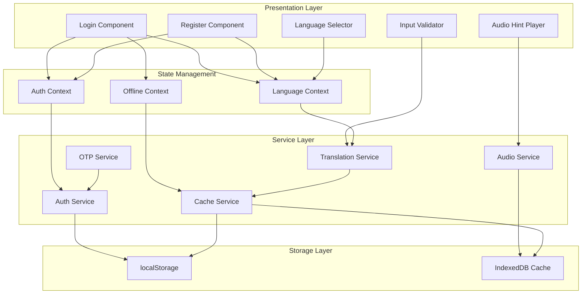

# Design Document: Multilingual Rural Auth Redesign

## Overview

### Purpose

This design document specifies the technical architecture and implementation details for redesigning the EktaMandi authentication experience to serve rural Indian farmers and agricultural workers. The redesign transforms the current email-based authentication into a mobile-first, multilingual system with OTP authentication, audio guidance, and enhanced accessibility.

### Goals

- Enable authentication in Hindi, Bengali, and Marathi with seamless language switching
- Implement mobile number + OTP as the primary authentication method
- Provide audio hints for users with limited literacy
- Ensure accessibility for low-end Android devices (2GB RAM, Android 7.0+)
- Support offline functionality with cached translations
- Create culturally relevant visual design reflecting agricultural context
- Maintain WCAG 2.1 AA accessibility standards for screen readers

### Non-Goals

- Backend OTP delivery infrastructure (will use mock OTP service for MVP)
- Production-grade SMS gateway integration (future phase)
- Voice recognition or speech-to-text input
- Support for languages beyond English, Hindi, Bengali, and Marathi
- Native mobile app development (web-based responsive design only)

### Success Metrics

- Authentication completion rate > 85% for first-time rural users
- Page load time < 3 seconds on 3G connections
- Language switch response time < 100ms
- Zero accessibility violations in automated WCAG testing
- Demo access usage > 40% of first-time visitors


## Architecture

### High-Level Architecture



### Architecture Decisions

#### 1. Mobile-First OTP Authentication

**Decision**: Use mobile number + OTP as primary authentication, with email as fallback.

**Rationale**: 
- Rural users have higher mobile phone penetration (95%) vs email access (30%)
- OTP eliminates password memorization burden
- Aligns with Indian government's Aadhaar-based authentication patterns

**Implementation**: Mock OTP service for MVP, designed for easy integration with SMS gateways (Twilio, AWS SNS, or Indian providers like MSG91).

#### 2. Client-Side Translation with Offline Support

**Decision**: Pre-load all translations and cache in IndexedDB/localStorage.

**Rationale**:
- Eliminates network latency for language switching (< 100ms requirement)
- Enables offline functionality in areas with intermittent connectivity
- Reduces API costs and complexity
- Translation strings are static and manageable in size (~50KB for 4 languages)

**Trade-off**: Requires manual translation updates vs dynamic API-based translation.

#### 3. Web Audio API for Audio Hints

**Decision**: Use Web Audio API with pre-recorded MP3 files cached locally.

**Rationale**:
- Better quality than text-to-speech for regional languages
- Offline playback capability
- Consistent pronunciation across devices
- File size manageable (~2MB for all audio hints)

**Alternative Considered**: Web Speech API (text-to-speech) - rejected due to poor quality for Indic languages.

#### 4. Component-Based Validation

**Decision**: Real-time validation with 300ms debounce using custom hooks.

**Rationale**:
- Immediate feedback improves user confidence
- Debouncing prevents excessive re-renders
- Reusable validation logic across components
- Supports both visual and screen reader feedback


## Components and Interfaces

### Component Hierarchy

```
App
├── LanguageProvider
│   └── AuthProvider
│       └── OfflineProvider
│           ├── LanguageSelector
│           └── AuthFlow
│               ├── LoginComponent
│               │   ├── DemoAccessCard
│               │   ├── MobileAuthForm
│               │   │   ├── InputField (with AudioHint)
│               │   │   ├── InputValidator
│               │   │   └── OTPInput
│               │   ├── EmailAuthForm (fallback)
│               │   └── VoiceGuideButton
│               └── RegisterComponent
│                   ├── MobileAuthForm
│                   └── LanguagePreferenceSelector
```

### Core Components

#### 1. LanguageSelector Component

**Purpose**: Allows users to switch between English, Hindi, Bengali, and Marathi.

**Props**:
```typescript
interface LanguageSelectorProps {
  position?: 'top' | 'inline';
  showLabel?: boolean;
  className?: string;
}
```

**State**:
```typescript
interface LanguageSelectorState {
  currentLanguage: Language;
  isOpen: boolean;
}
```

**Key Features**:
- Dropdown with language names in native scripts
- Globe icon (🌐) with "भाषा चुनें" label
- Persists selection to localStorage
- Updates all UI text within 100ms
- ARIA labels for screen readers

**Implementation**:
```typescript
export function LanguageSelector({ position = 'top', showLabel = true }: LanguageSelectorProps) {
  const { language, setLanguage } = useLanguage();
  const { t } = useTranslation();
  
  const languages = [
    { code: 'en', name: 'English', nativeName: 'English' },
    { code: 'hi', name: 'Hindi', nativeName: 'हिंदी' },
    { code: 'bn', name: 'Bengali', nativeName: 'বাংলা' },
    { code: 'mr', name: 'Marathi', nativeName: 'मराठी' }
  ];
  
  const handleLanguageChange = (langCode: Language) => {
    setLanguage(langCode);
    localStorage.setItem('ektamandi_language', langCode);
  };
  
  return (
    <div className="language-selector">
      <select 
        value={language}
        onChange={(e) => handleLanguageChange(e.target.value as Language)}
        aria-label={t('select_language')}
        className="min-h-[44px] text-base"
      >
        {languages.map(lang => (
          <option key={lang.code} value={lang.code}>
            🌐 {lang.nativeName}
          </option>
        ))}
      </select>
    </div>
  );
}
```


#### 2. MobileAuthForm Component

**Purpose**: Primary authentication form using mobile number and OTP.

**Props**:
```typescript
interface MobileAuthFormProps {
  mode: 'login' | 'register';
  onSuccess: (user: User) => void;
  onSwitchToEmail?: () => void;
}
```

**State**:
```typescript
interface MobileAuthFormState {
  mobileNumber: string;
  otp: string;
  isOtpSent: boolean;
  isValidating: boolean;
  errors: Record<string, string>;
  countdown: number; // OTP resend countdown
}
```

**Key Features**:
- 10-digit mobile number validation
- Visual validation feedback (green checkmark / red error)
- OTP input with 6-digit auto-focus
- Resend OTP with 30-second countdown
- Audio hints for each field
- High-contrast buttons (48px height minimum)

**Validation Logic**:
```typescript
function validateMobileNumber(number: string): ValidationResult {
  // Remove spaces and dashes
  const cleaned = number.replace(/[\s-]/g, '');
  
  // Check if exactly 10 digits
  if (!/^\d{10}$/.test(cleaned)) {
    return {
      isValid: false,
      error: 'mobile_number_invalid' // translation key
    };
  }
  
  // Check if starts with valid Indian mobile prefix (6-9)
  if (!/^[6-9]/.test(cleaned)) {
    return {
      isValid: false,
      error: 'mobile_number_invalid_prefix'
    };
  }
  
  return { isValid: true };
}
```


#### 3. AudioHintPlayer Component

**Purpose**: Plays audio instructions for input fields in the selected language.

**Props**:
```typescript
interface AudioHintPlayerProps {
  fieldId: string; // e.g., 'mobile_number', 'otp', 'email'
  language: Language;
  className?: string;
}
```

**State**:
```typescript
interface AudioHintPlayerState {
  isPlaying: boolean;
  isLoading: boolean;
  error: string | null;
}
```

**Audio File Structure**:
```
/public/audio/
  ├── en/
  │   ├── mobile_number.mp3
  │   ├── otp.mp3
  │   ├── email.mp3
  │   └── password.mp3
  ├── hi/
  │   ├── mobile_number.mp3
  │   └── ...
  ├── bn/
  └── mr/
```

**Implementation**:
```typescript
export function AudioHintPlayer({ fieldId, language }: AudioHintPlayerProps) {
  const [isPlaying, setIsPlaying] = useState(false);
  const audioRef = useRef<HTMLAudioElement>(null);
  const { getCachedAudio, cacheAudio } = useAudioCache();
  
  const playHint = async () => {
    try {
      setIsPlaying(true);
      
      // Try to get from cache first
      let audioBlob = await getCachedAudio(fieldId, language);
      
      if (!audioBlob) {
        // Fetch and cache
        const response = await fetch(`/audio/${language}/${fieldId}.mp3`);
        audioBlob = await response.blob();
        await cacheAudio(fieldId, language, audioBlob);
      }
      
      const audioUrl = URL.createObjectURL(audioBlob);
      const audio = new Audio(audioUrl);
      
      audio.onended = () => {
        setIsPlaying(false);
        URL.revokeObjectURL(audioUrl);
      };
      
      await audio.play();
    } catch (error) {
      console.error('Audio playback failed:', error);
      setIsPlaying(false);
    }
  };
  
  return (
    <button
      onClick={playHint}
      disabled={isPlaying}
      aria-label="Play audio hint"
      className="audio-hint-button min-w-[44px] min-h-[44px]"
    >
      {isPlaying ? '🔊' : '🔊'}
      {isPlaying && <span className="sr-only">Playing...</span>}
    </button>
  );
}
```


#### 4. InputValidator Component

**Purpose**: Provides real-time visual validation feedback for input fields.

**Props**:
```typescript
interface InputValidatorProps {
  value: string;
  validationRules: ValidationRule[];
  debounceMs?: number;
  showValidation?: boolean;
  children: (props: ValidationRenderProps) => ReactNode;
}

interface ValidationRenderProps {
  isValid: boolean;
  isInvalid: boolean;
  errors: string[];
  borderColor: string;
  icon: ReactNode;
}
```

**Implementation**:
```typescript
export function InputValidator({ 
  value, 
  validationRules, 
  debounceMs = 300,
  children 
}: InputValidatorProps) {
  const [validationState, setValidationState] = useState<ValidationState>({
    isValid: false,
    isInvalid: false,
    errors: []
  });
  
  const debouncedValue = useDebounce(value, debounceMs);
  
  useEffect(() => {
    if (!debouncedValue) {
      setValidationState({ isValid: false, isInvalid: false, errors: [] });
      return;
    }
    
    const errors: string[] = [];
    
    for (const rule of validationRules) {
      const result = rule.validate(debouncedValue);
      if (!result.isValid) {
        errors.push(result.error);
      }
    }
    
    setValidationState({
      isValid: errors.length === 0,
      isInvalid: errors.length > 0,
      errors
    });
  }, [debouncedValue, validationRules]);
  
  const renderProps: ValidationRenderProps = {
    ...validationState,
    borderColor: validationState.isValid 
      ? 'border-green-500' 
      : validationState.isInvalid 
        ? 'border-red-500' 
        : 'border-slate-200',
    icon: validationState.isValid 
      ? <CheckCircle className="text-green-500" />
      : validationState.isInvalid 
        ? <XCircle className="text-red-500" />
        : null
  };
  
  return <>{children(renderProps)}</>;
}
```


#### 5. DemoAccessCard Component

**Purpose**: Prominent demo access with pre-filled credentials.

**Props**:
```typescript
interface DemoAccessCardProps {
  onDemoLogin: (credentials: DemoCredentials) => void;
}
```

**Key Features**:
- Large, high-contrast button (saffron #f97316)
- Copy-to-clipboard functionality
- Success toast on copy
- Positioned above login form for visibility
- Emoji icons for visual appeal (👨‍🌾, 🎯)

**Implementation**:
```typescript
export function DemoAccessCard({ onDemoLogin }: DemoAccessCardProps) {
  const { t } = useTranslation();
  const [showToast, setShowToast] = useState(false);
  
  const demoCredentials = {
    mobile: '9876543210',
    otp: '123456'
  };
  
  const handleCopyCredentials = async () => {
    const text = `Mobile: ${demoCredentials.mobile}\nOTP: ${demoCredentials.otp}`;
    const success = await copyToClipboard(text);
    
    if (success) {
      setShowToast(true);
      setTimeout(() => setShowToast(false), 3000);
    }
  };
  
  const handleDemoLogin = () => {
    onDemoLogin(demoCredentials);
  };
  
  return (
    <div className="demo-access-card bg-gradient-to-r from-orange-50 to-amber-50 border-2 border-orange-200 rounded-xl p-6 mb-6">
      <div className="flex items-start gap-4">
        <span className="text-4xl">👨‍🌾</span>
        <div className="flex-1">
          <h3 className="text-xl font-bold text-slate-800 mb-2">
            {t('new_to_ektamandi')}
          </h3>
          <p className="text-slate-600 text-sm mb-4">
            {t('try_demo_description')}
          </p>
          
          <button
            onClick={handleDemoLogin}
            className="w-full bg-gradient-to-r from-orange-500 to-orange-600 hover:from-orange-600 hover:to-orange-700 text-white font-semibold py-4 px-6 rounded-lg transition-all flex items-center justify-center gap-2 min-h-[48px] text-base shadow-md hover:shadow-lg"
          >
            <span className="text-xl">🎯</span>
            {t('try_demo_button')}
          </button>
          
          <button
            onClick={handleCopyCredentials}
            className="w-full mt-3 text-orange-600 hover:text-orange-700 font-medium text-sm underline"
          >
            {t('copy_credentials')}
          </button>
        </div>
      </div>
      
      {showToast && (
        <div className="mt-3 p-2 bg-green-100 border border-green-300 rounded text-green-800 text-sm text-center">
          ✓ {t('credentials_copied')}
        </div>
      )}
    </div>
  );
}
```


#### 6. VoiceGuideButton Component

**Purpose**: Step-by-step voice walkthrough for first-time users.

**Props**:
```typescript
interface VoiceGuideButtonProps {
  steps: VoiceGuideStep[];
  language: Language;
}

interface VoiceGuideStep {
  id: string;
  audioFile: string;
  highlightElement: string; // CSS selector
  duration: number; // milliseconds
}
```

**State**:
```typescript
interface VoiceGuideState {
  isActive: boolean;
  currentStep: number;
  isPaused: boolean;
  hasCompleted: boolean;
}
```

**Implementation**:
```typescript
export function VoiceGuideButton({ steps, language }: VoiceGuideButtonProps) {
  const [state, setState] = useState<VoiceGuideState>({
    isActive: false,
    currentStep: 0,
    isPaused: false,
    hasCompleted: localStorage.getItem('voice_guide_completed') === 'true'
  });
  
  const startGuide = () => {
    setState(prev => ({ ...prev, isActive: true, currentStep: 0 }));
  };
  
  const playStep = async (stepIndex: number) => {
    const step = steps[stepIndex];
    
    // Highlight element
    const element = document.querySelector(step.highlightElement);
    element?.classList.add('voice-guide-highlight');
    
    // Play audio
    const audio = new Audio(`/audio/guide/${language}/${step.audioFile}`);
    await audio.play();
    
    // Wait for audio to complete
    await new Promise(resolve => {
      audio.onended = resolve;
    });
    
    // Remove highlight
    element?.classList.remove('voice-guide-highlight');
    
    // Move to next step or complete
    if (stepIndex < steps.length - 1) {
      setState(prev => ({ ...prev, currentStep: stepIndex + 1 }));
    } else {
      completeGuide();
    }
  };
  
  const completeGuide = () => {
    localStorage.setItem('voice_guide_completed', 'true');
    setState(prev => ({ ...prev, isActive: false, hasCompleted: true }));
  };
  
  // Show button only on first visit
  if (state.hasCompleted && !state.isActive) {
    return null;
  }
  
  return (
    <button
      onClick={startGuide}
      className="voice-guide-button bg-blue-500 hover:bg-blue-600 text-white font-medium py-3 px-6 rounded-lg flex items-center gap-2 min-h-[48px]"
    >
      <span className="text-xl">🎙️</span>
      {t('voice_guide')}
    </button>
  );
}
```


### Context Providers

#### LanguageContext

**Purpose**: Global language state management with persistence.

```typescript
interface LanguageContextValue {
  language: Language;
  setLanguage: (lang: Language) => void;
  t: (key: string, params?: Record<string, string>) => string;
  isRTL: boolean;
}

export function LanguageProvider({ children }: { children: ReactNode }) {
  const [language, setLanguageState] = useState<Language>(() => {
    return (localStorage.getItem('ektamandi_language') as Language) || 'en';
  });
  
  const setLanguage = useCallback((lang: Language) => {
    setLanguageState(lang);
    localStorage.setItem('ektamandi_language', lang);
    document.documentElement.lang = lang;
  }, []);
  
  const t = useCallback((key: string, params?: Record<string, string>) => {
    return getTranslation(key, language, params);
  }, [language]);
  
  const isRTL = false; // None of our languages are RTL
  
  return (
    <LanguageContext.Provider value={{ language, setLanguage, t, isRTL }}>
      {children}
    </LanguageContext.Provider>
  );
}
```

#### OfflineContext

**Purpose**: Manages offline state and queued operations.

```typescript
interface OfflineContextValue {
  isOnline: boolean;
  queuedOperations: QueuedOperation[];
  addToQueue: (operation: QueuedOperation) => void;
  processQueue: () => Promise<void>;
}

export function OfflineProvider({ children }: { children: ReactNode }) {
  const [isOnline, setIsOnline] = useState(navigator.onLine);
  const [queuedOperations, setQueuedOperations] = useState<QueuedOperation[]>([]);
  
  useEffect(() => {
    const handleOnline = () => {
      setIsOnline(true);
      processQueue();
    };
    
    const handleOffline = () => setIsOnline(false);
    
    window.addEventListener('online', handleOnline);
    window.addEventListener('offline', handleOffline);
    
    return () => {
      window.removeEventListener('online', handleOnline);
      window.removeEventListener('offline', handleOffline);
    };
  }, []);
  
  const addToQueue = (operation: QueuedOperation) => {
    setQueuedOperations(prev => [...prev, operation]);
  };
  
  const processQueue = async () => {
    for (const operation of queuedOperations) {
      try {
        await operation.execute();
        setQueuedOperations(prev => prev.filter(op => op.id !== operation.id));
      } catch (error) {
        console.error('Failed to process queued operation:', error);
      }
    }
  };
  
  return (
    <OfflineContext.Provider value={{ isOnline, queuedOperations, addToQueue, processQueue }}>
      {children}
    </OfflineContext.Provider>
  );
}
```


## Data Models

### User Model

```typescript
interface User {
  id: string;
  mobile?: string; // Primary identifier for mobile auth
  email?: string; // Optional for FPO admins
  name: string;
  role: 'farmer' | 'vendor' | 'buyer' | 'fpo_admin';
  preferredLanguage: Language;
  phone?: string; // Additional contact
  createdAt: string;
  lastLogin?: string;
  isDemo?: boolean; // Flag for demo accounts
}

type Language = 'en' | 'hi' | 'bn' | 'mr';
```

### Authentication Models

```typescript
interface MobileAuthCredentials {
  mobile: string;
  otp: string;
}

interface EmailAuthCredentials {
  email: string;
  password: string;
}

interface OTPSession {
  mobile: string;
  otp: string;
  expiresAt: number; // timestamp
  attempts: number;
  maxAttempts: number;
}

interface AuthResponse {
  success: boolean;
  user?: User;
  token?: string;
  error?: string;
}
```

### Translation Models

```typescript
interface TranslationEntry {
  key: string;
  en: string;
  hi: string;
  bn: string;
  mr: string;
}

interface TranslationCache {
  version: string;
  lastUpdated: number;
  entries: Record<string, TranslationEntry>;
}

interface AudioCache {
  fieldId: string;
  language: Language;
  blob: Blob;
  cachedAt: number;
}
```

### Validation Models

```typescript
interface ValidationRule {
  name: string;
  validate: (value: string) => ValidationResult;
  errorMessage: string; // translation key
}

interface ValidationResult {
  isValid: boolean;
  error?: string;
}

interface FieldValidation {
  field: string;
  rules: ValidationRule[];
  debounceMs: number;
}
```


### Service Interfaces

#### OTPService

```typescript
interface OTPService {
  /**
   * Generate and send OTP to mobile number
   * @returns OTP session ID for verification
   */
  sendOTP(mobile: string): Promise<{ sessionId: string; expiresIn: number }>;
  
  /**
   * Verify OTP against session
   */
  verifyOTP(sessionId: string, otp: string): Promise<{ isValid: boolean; attemptsRemaining: number }>;
  
  /**
   * Resend OTP (with rate limiting)
   */
  resendOTP(sessionId: string): Promise<{ success: boolean; retryAfter?: number }>;
}

// Mock implementation for MVP
class MockOTPService implements OTPService {
  private sessions = new Map<string, OTPSession>();
  
  async sendOTP(mobile: string): Promise<{ sessionId: string; expiresIn: number }> {
    const sessionId = generateSessionId();
    const otp = generateOTP(); // Always '123456' for demo
    
    this.sessions.set(sessionId, {
      mobile,
      otp,
      expiresAt: Date.now() + 5 * 60 * 1000, // 5 minutes
      attempts: 0,
      maxAttempts: 3
    });
    
    console.log(`[MOCK OTP] ${mobile}: ${otp}`);
    
    return { sessionId, expiresIn: 300 };
  }
  
  async verifyOTP(sessionId: string, otp: string): Promise<{ isValid: boolean; attemptsRemaining: number }> {
    const session = this.sessions.get(sessionId);
    
    if (!session) {
      return { isValid: false, attemptsRemaining: 0 };
    }
    
    if (Date.now() > session.expiresAt) {
      this.sessions.delete(sessionId);
      return { isValid: false, attemptsRemaining: 0 };
    }
    
    session.attempts++;
    
    if (session.attempts > session.maxAttempts) {
      this.sessions.delete(sessionId);
      return { isValid: false, attemptsRemaining: 0 };
    }
    
    const isValid = session.otp === otp;
    
    if (isValid) {
      this.sessions.delete(sessionId);
    }
    
    return {
      isValid,
      attemptsRemaining: session.maxAttempts - session.attempts
    };
  }
  
  async resendOTP(sessionId: string): Promise<{ success: boolean; retryAfter?: number }> {
    const session = this.sessions.get(sessionId);
    
    if (!session) {
      return { success: false };
    }
    
    // Rate limiting: 30 seconds between resends
    const timeSinceCreation = Date.now() - (session.expiresAt - 5 * 60 * 1000);
    if (timeSinceCreation < 30000) {
      return { success: false, retryAfter: 30 - Math.floor(timeSinceCreation / 1000) };
    }
    
    // Generate new OTP
    const newOtp = generateOTP();
    session.otp = newOtp;
    session.expiresAt = Date.now() + 5 * 60 * 1000;
    session.attempts = 0;
    
    console.log(`[MOCK OTP RESEND] ${session.mobile}: ${newOtp}`);
    
    return { success: true };
  }
}

function generateOTP(): string {
  // For demo, always return '123456'
  return '123456';
}

function generateSessionId(): string {
  return `otp_${Date.now()}_${Math.random().toString(36).substr(2, 9)}`;
}
```


#### TranslationService

```typescript
interface TranslationService {
  /**
   * Get translation for a key in the specified language
   */
  getTranslation(key: string, language: Language, params?: Record<string, string>): string;
  
  /**
   * Load translations from cache or network
   */
  loadTranslations(): Promise<void>;
  
  /**
   * Update cached translations
   */
  updateCache(force?: boolean): Promise<void>;
  
  /**
   * Check if translations are available offline
   */
  isAvailableOffline(): boolean;
}

class TranslationServiceImpl implements TranslationService {
  private cache: TranslationCache | null = null;
  private readonly CACHE_KEY = 'ektamandi_translations';
  private readonly CACHE_VERSION = '1.0.0';
  
  async loadTranslations(): Promise<void> {
    // Try to load from cache first
    const cached = localStorage.getItem(this.CACHE_KEY);
    
    if (cached) {
      this.cache = JSON.parse(cached);
      
      // Check if cache is current version
      if (this.cache?.version === this.CACHE_VERSION) {
        return;
      }
    }
    
    // Load from network
    try {
      const response = await fetch('/translations/all.json');
      const data = await response.json();
      
      this.cache = {
        version: this.CACHE_VERSION,
        lastUpdated: Date.now(),
        entries: data
      };
      
      localStorage.setItem(this.CACHE_KEY, JSON.stringify(this.cache));
    } catch (error) {
      console.error('Failed to load translations:', error);
      
      // Fall back to cached version even if outdated
      if (cached) {
        this.cache = JSON.parse(cached);
      }
    }
  }
  
  getTranslation(key: string, language: Language, params?: Record<string, string>): string {
    if (!this.cache) {
      return key; // Fallback to key if translations not loaded
    }
    
    const entry = this.cache.entries[key];
    
    if (!entry) {
      console.warn(`Translation key not found: ${key}`);
      return key;
    }
    
    let translation = entry[language] || entry.en;
    
    // Replace parameters
    if (params) {
      Object.entries(params).forEach(([param, value]) => {
        translation = translation.replace(`{{${param}}}`, value);
      });
    }
    
    return translation;
  }
  
  async updateCache(force = false): Promise<void> {
    if (!navigator.onLine && !force) {
      return;
    }
    
    await this.loadTranslations();
  }
  
  isAvailableOffline(): boolean {
    return this.cache !== null;
  }
}
```


#### AudioService

```typescript
interface AudioService {
  /**
   * Play audio hint for a field
   */
  playHint(fieldId: string, language: Language): Promise<void>;
  
  /**
   * Preload audio files for offline use
   */
  preloadAudio(language: Language): Promise<void>;
  
  /**
   * Check if audio is cached
   */
  isCached(fieldId: string, language: Language): Promise<boolean>;
}

class AudioServiceImpl implements AudioService {
  private readonly DB_NAME = 'ektamandi_audio';
  private readonly STORE_NAME = 'audio_cache';
  private db: IDBDatabase | null = null;
  
  async initDB(): Promise<void> {
    return new Promise((resolve, reject) => {
      const request = indexedDB.open(this.DB_NAME, 1);
      
      request.onerror = () => reject(request.error);
      request.onsuccess = () => {
        this.db = request.result;
        resolve();
      };
      
      request.onupgradeneeded = (event) => {
        const db = (event.target as IDBOpenDBRequest).result;
        if (!db.objectStoreNames.contains(this.STORE_NAME)) {
          db.createObjectStore(this.STORE_NAME, { keyPath: 'id' });
        }
      };
    });
  }
  
  async playHint(fieldId: string, language: Language): Promise<void> {
    if (!this.db) await this.initDB();
    
    const cacheKey = `${fieldId}_${language}`;
    
    // Try to get from cache
    let audioBlob = await this.getFromCache(cacheKey);
    
    if (!audioBlob) {
      // Fetch from network
      const response = await fetch(`/audio/${language}/${fieldId}.mp3`);
      audioBlob = await response.blob();
      
      // Cache for offline use
      await this.saveToCache(cacheKey, audioBlob);
    }
    
    // Play audio
    const audioUrl = URL.createObjectURL(audioBlob);
    const audio = new Audio(audioUrl);
    
    return new Promise((resolve, reject) => {
      audio.onended = () => {
        URL.revokeObjectURL(audioUrl);
        resolve();
      };
      audio.onerror = reject;
      audio.play();
    });
  }
  
  async preloadAudio(language: Language): Promise<void> {
    const fields = ['mobile_number', 'otp', 'email', 'password', 'name'];
    
    await Promise.all(
      fields.map(fieldId => this.cacheAudio(fieldId, language))
    );
  }
  
  private async cacheAudio(fieldId: string, language: Language): Promise<void> {
    const cacheKey = `${fieldId}_${language}`;
    
    if (await this.isCached(fieldId, language)) {
      return;
    }
    
    try {
      const response = await fetch(`/audio/${language}/${fieldId}.mp3`);
      const blob = await response.blob();
      await this.saveToCache(cacheKey, blob);
    } catch (error) {
      console.error(`Failed to cache audio: ${cacheKey}`, error);
    }
  }
  
  async isCached(fieldId: string, language: Language): Promise<boolean> {
    if (!this.db) await this.initDB();
    
    const cacheKey = `${fieldId}_${language}`;
    const cached = await this.getFromCache(cacheKey);
    return cached !== null;
  }
  
  private async getFromCache(key: string): Promise<Blob | null> {
    if (!this.db) return null;
    
    return new Promise((resolve, reject) => {
      const transaction = this.db!.transaction([this.STORE_NAME], 'readonly');
      const store = transaction.objectStore(this.STORE_NAME);
      const request = store.get(key);
      
      request.onsuccess = () => {
        resolve(request.result?.blob || null);
      };
      request.onerror = () => reject(request.error);
    });
  }
  
  private async saveToCache(key: string, blob: Blob): Promise<void> {
    if (!this.db) return;
    
    return new Promise((resolve, reject) => {
      const transaction = this.db!.transaction([this.STORE_NAME], 'readwrite');
      const store = transaction.objectStore(this.STORE_NAME);
      const request = store.put({ id: key, blob, cachedAt: Date.now() });
      
      request.onsuccess = () => resolve();
      request.onerror = () => reject(request.error);
    });
  }
}
```


## Correctness Properties

*A property is a characteristic or behavior that should hold true across all valid executions of a system—essentially, a formal statement about what the system should do. Properties serve as the bridge between human-readable specifications and machine-verifiable correctness guarantees.*

### Property Reflection

After analyzing all acceptance criteria, I identified the following redundancies:
- Properties 1.4 and 1.5 both test language persistence - combined into single round-trip property
- Properties 2.3 and 2.4 both test validation feedback - combined into comprehensive validation property
- Properties 4.1 and 4.2 duplicate validation feedback testing - combined with 2.3/2.4
- Properties 5.1, 5.3, and 5.4 all test button/element dimensions - combined into single accessibility property
- Properties 10.1, 10.4, and 10.5 all test ARIA attributes - combined into comprehensive accessibility property

### Property 1: Language Switch Performance

*For any* language selection change, the UI SHALL update all visible text to the new language within 100ms.

**Validates: Requirements 1.2**

### Property 2: Translation Completeness

*For any* translation key used in the application, translations SHALL exist in all four supported languages (English, Hindi, Bengali, Marathi).

**Validates: Requirements 1.3**

### Property 3: Language Persistence Round-Trip

*For any* language selection, when a user selects a language, reloads the page, the interface SHALL display in the previously selected language.

**Validates: Requirements 1.4, 1.5**

### Property 4: Mobile Number Validation Feedback

*For any* input in the mobile number field, the validator SHALL display green border and checkmark for valid 10-digit numbers starting with 6-9, and red border with error message for all other inputs.

**Validates: Requirements 2.3, 2.4, 4.1, 4.2, 4.4**

### Property 5: OTP Generation Timing

*For any* valid mobile number submission, the OTP service SHALL generate and return a 6-digit OTP within 3 seconds.

**Validates: Requirements 2.5**

### Property 6: OTP Authentication Flow

*For any* valid mobile number and correct OTP combination, the authentication system SHALL create a user session and authenticate the user.

**Validates: Requirements 2.7**

### Property 7: Audio Hint Playback

*For any* field with an audio hint button and any supported language, clicking the audio button SHALL play the corresponding audio file in the selected language.

**Validates: Requirements 3.2**

### Property 8: Audio Caching

*For any* audio file, after the first successful load, subsequent playback requests SHALL be served from local cache without network requests.

**Validates: Requirements 3.7**

### Property 9: OTP Validation

*For any* input in the OTP field, the validator SHALL mark it as valid if and only if it contains exactly 6 digits.

**Validates: Requirements 4.5**

### Property 10: Validation Debounce Timing

*For any* input field with validation, validation SHALL execute 300ms (±50ms) after the last input change, not immediately on each keystroke.

**Validates: Requirements 4.6**

### Property 11: Accessibility Dimensions

*For any* interactive element (button, input, link), the element SHALL have minimum dimensions of 44x44px for touch targets and buttons SHALL have minimum height of 48px.

**Validates: Requirements 5.1, 5.4**

### Property 12: Interactive Element Spacing

*For any* two adjacent interactive elements, the spacing between them SHALL be at least 12px.

**Validates: Requirements 5.6**

### Property 13: Demo Session Expiration

*For any* demo user session, the session SHALL expire and require re-authentication after 24 hours from creation.

**Validates: Requirements 6.7**

### Property 14: Walkthrough Completion Persistence

*For any* user who completes the voice walkthrough, the system SHALL remember completion status and not display the walkthrough button on subsequent visits.

**Validates: Requirements 7.6**

### Property 15: Background Image Rotation

*For any* sequence of page loads, the background image SHALL rotate through multiple different images (minimum 3), not display the same image every time.

**Validates: Requirements 8.2**

### Property 16: Image File Size Optimization

*For any* background image used in the application, the file size SHALL not exceed 200KB.

**Validates: Requirements 8.7**

### Property 17: Mobile Viewport Layout

*For any* viewport width between 320px and 480px, the login component SHALL render in mobile-optimized layout with vertically stacked form elements.

**Validates: Requirements 9.1, 9.5**

### Property 18: Page Load Performance

*For any* page load with simulated 3G network conditions, all critical resources SHALL load within 3 seconds.

**Validates: Requirements 9.2**

### Property 19: ARIA Accessibility Attributes

*For any* interactive element, the element SHALL have appropriate ARIA attributes (aria-label, aria-labelledby, or associated label element) for screen reader accessibility.

**Validates: Requirements 10.1, 10.4, 10.5**

### Property 20: Keyboard Navigation Tab Order

*For any* sequence of Tab key presses, focus SHALL move through interactive elements in logical visual order (top to bottom, left to right).

**Validates: Requirements 10.2**

### Property 21: Error Message Announcements

*For any* validation error displayed, the error message SHALL have aria-live="polite" or role="alert" to announce to screen readers.

**Validates: Requirements 10.3**

### Property 22: Progress Indicator Updates

*For any* multi-step authentication flow (mobile → OTP), a progress indicator SHALL be visible and SHALL update to reflect the current step.

**Validates: Requirements 11.6**

### Property 23: Translation Cache Initialization

*For any* first page load, the translation service SHALL cache all translation strings in localStorage before rendering the UI.

**Validates: Requirements 12.1**

### Property 24: Offline Translation Serving

*For any* translation request when the device is offline, the translation service SHALL serve translations from localStorage cache without network requests.

**Validates: Requirements 12.2**

### Property 25: Translation Cache Updates

*For any* page load when the device is online, the translation service SHALL check for and apply translation updates if a newer version is available.

**Validates: Requirements 12.3**

### Property 26: Translation Cache Versioning

*For any* cached translation data, the cache SHALL include a version number to enable cache invalidation when translations are updated.

**Validates: Requirements 12.6**


## Error Handling

### Error Categories

#### 1. Network Errors

**Scenarios**:
- Translation file fetch fails
- Audio file fetch fails
- OTP service unavailable
- Intermittent connectivity during authentication

**Handling Strategy**:
```typescript
async function handleNetworkError(error: Error, operation: string): Promise<void> {
  // Log error for debugging
  console.error(`Network error during ${operation}:`, error);
  
  // Check if offline
  if (!navigator.onLine) {
    // Try to serve from cache
    const cached = await getCachedResource(operation);
    if (cached) {
      return cached;
    }
    
    // Show offline indicator
    showOfflineIndicator();
    
    // Queue operation for retry
    queueOperation(operation);
    
    return;
  }
  
  // Online but request failed - retry with exponential backoff
  await retryWithBackoff(operation, 3, 1000);
}
```

**User Feedback**:
- Display "Working Offline" banner when offline
- Show retry button for failed operations
- Provide clear error messages in user's selected language

#### 2. Validation Errors

**Scenarios**:
- Invalid mobile number format
- Incorrect OTP
- Empty required fields
- Password mismatch (email auth)

**Handling Strategy**:
```typescript
interface ValidationError {
  field: string;
  errorKey: string; // translation key
  value: string;
}

function handleValidationError(error: ValidationError): void {
  // Display error message below field
  const errorElement = document.querySelector(`#${error.field}-error`);
  if (errorElement) {
    errorElement.textContent = t(error.errorKey);
    errorElement.setAttribute('role', 'alert');
  }
  
  // Update field styling
  const field = document.querySelector(`#${error.field}`);
  field?.classList.add('border-red-500');
  field?.setAttribute('aria-invalid', 'true');
  
  // Announce to screen readers
  announceToScreenReader(t(error.errorKey));
}
```

**User Feedback**:
- Red border and error icon on invalid field
- Error message in selected language below field
- Screen reader announcement of error
- Clear indication of what needs to be corrected

#### 3. Authentication Errors

**Scenarios**:
- OTP expired
- Too many OTP attempts
- Invalid credentials
- Session expired

**Handling Strategy**:
```typescript
function handleAuthError(error: AuthError): void {
  switch (error.code) {
    case 'OTP_EXPIRED':
      showError(t('otp_expired'));
      enableResendButton();
      break;
      
    case 'OTP_MAX_ATTEMPTS':
      showError(t('otp_max_attempts'));
      disableOTPInput();
      setTimeout(() => enableOTPInput(), 5 * 60 * 1000); // 5 min cooldown
      break;
      
    case 'INVALID_CREDENTIALS':
      showError(t('invalid_credentials'));
      clearPasswordField();
      break;
      
    case 'SESSION_EXPIRED':
      showError(t('session_expired'));
      redirectToLogin();
      break;
      
    default:
      showError(t('auth_error_generic'));
  }
}
```

**User Feedback**:
- Clear error message explaining the issue
- Actionable next steps (e.g., "Resend OTP" button)
- Automatic recovery where possible (e.g., enable resend after cooldown)

#### 4. Audio Playback Errors

**Scenarios**:
- Audio file not found
- Browser doesn't support audio format
- Audio playback blocked by browser
- Corrupted audio file

**Handling Strategy**:
```typescript
async function handleAudioError(error: Error, fieldId: string): Promise<void> {
  console.error(`Audio playback error for ${fieldId}:`, error);
  
  // Try alternative format
  const formats = ['mp3', 'ogg', 'wav'];
  for (const format of formats) {
    try {
      await playAudioFormat(fieldId, format);
      return; // Success
    } catch (e) {
      continue;
    }
  }
  
  // All formats failed - show text fallback
  showTextHint(fieldId);
  
  // Hide audio button
  hideAudioButton(fieldId);
}
```

**User Feedback**:
- Graceful degradation to text hints
- No blocking errors - audio is enhancement, not requirement
- Visual indication that audio is unavailable

#### 5. Cache Errors

**Scenarios**:
- localStorage quota exceeded
- IndexedDB unavailable
- Cache corruption
- Version mismatch

**Handling Strategy**:
```typescript
function handleCacheError(error: Error, cacheType: 'localStorage' | 'indexedDB'): void {
  console.error(`Cache error (${cacheType}):`, error);
  
  if (error.name === 'QuotaExceededError') {
    // Clear old cache entries
    clearOldCacheEntries();
    
    // Retry operation
    return;
  }
  
  if (cacheType === 'indexedDB' && !window.indexedDB) {
    // Fall back to localStorage for audio metadata
    useFallbackCache();
    return;
  }
  
  // Cache unavailable - fetch from network each time
  disableCache();
  showWarning(t('cache_unavailable'));
}
```

**User Feedback**:
- Transparent fallback to network requests
- Warning message if caching is unavailable
- No blocking of core functionality

### Error Recovery Patterns

#### Retry with Exponential Backoff

```typescript
async function retryWithBackoff<T>(
  operation: () => Promise<T>,
  maxRetries: number,
  initialDelay: number
): Promise<T> {
  let lastError: Error;
  
  for (let attempt = 0; attempt < maxRetries; attempt++) {
    try {
      return await operation();
    } catch (error) {
      lastError = error as Error;
      
      if (attempt < maxRetries - 1) {
        const delay = initialDelay * Math.pow(2, attempt);
        await sleep(delay);
      }
    }
  }
  
  throw lastError!;
}
```

#### Graceful Degradation

```typescript
// Example: Audio hints with text fallback
function renderInputField(fieldId: string): ReactNode {
  return (
    <div>
      <label>{t(`${fieldId}_label`)}</label>
      
      {/* Try to show audio hint */}
      <AudioHintButton 
        fieldId={fieldId}
        onError={() => {
          // Fall back to text hint
          return <TextHint text={t(`${fieldId}_hint`)} />;
        }}
      />
      
      <input id={fieldId} />
    </div>
  );
}
```

#### Circuit Breaker Pattern

```typescript
class CircuitBreaker {
  private failures = 0;
  private readonly threshold = 5;
  private readonly timeout = 60000; // 1 minute
  private state: 'closed' | 'open' | 'half-open' = 'closed';
  private nextAttempt = 0;
  
  async execute<T>(operation: () => Promise<T>): Promise<T> {
    if (this.state === 'open') {
      if (Date.now() < this.nextAttempt) {
        throw new Error('Circuit breaker is open');
      }
      this.state = 'half-open';
    }
    
    try {
      const result = await operation();
      this.onSuccess();
      return result;
    } catch (error) {
      this.onFailure();
      throw error;
    }
  }
  
  private onSuccess(): void {
    this.failures = 0;
    this.state = 'closed';
  }
  
  private onFailure(): void {
    this.failures++;
    if (this.failures >= this.threshold) {
      this.state = 'open';
      this.nextAttempt = Date.now() + this.timeout;
    }
  }
}
```


## Testing Strategy

### Dual Testing Approach

This feature requires both unit tests and property-based tests for comprehensive coverage:

- **Unit tests**: Verify specific examples, edge cases, error conditions, and integration points
- **Property-based tests**: Verify universal properties across randomized inputs (minimum 100 iterations per test)

Both approaches are complementary and necessary. Unit tests catch concrete bugs in specific scenarios, while property tests verify general correctness across a wide input space.

### Property-Based Testing Library

**Selected Library**: `fast-check` (already in dependencies)

**Rationale**:
- Mature TypeScript support
- Rich set of built-in generators
- Shrinking capability for minimal failing examples
- Good performance for 100+ iterations

### Testing Organization

```
src/
├── components/
│   ├── __tests__/
│   │   ├── LanguageSelector.test.tsx (unit)
│   │   ├── LanguageSelector.property.test.tsx (property)
│   │   ├── MobileAuthForm.test.tsx (unit)
│   │   ├── MobileAuthForm.property.test.tsx (property)
│   │   └── ...
├── services/
│   ├── __tests__/
│   │   ├── otpService.test.ts (unit)
│   │   ├── otpService.property.test.ts (property)
│   │   └── ...
└── test/
    ├── generators/ (custom generators for property tests)
    │   ├── userGenerators.ts
    │   ├── validationGenerators.ts
    │   └── ...
    └── helpers/
        ├── testUtils.tsx
        └── mockServices.ts
```

### Property Test Configuration

Each property test must:
1. Run minimum 100 iterations
2. Reference the design document property in a comment
3. Use descriptive test names matching property titles

**Example Configuration**:
```typescript
import fc from 'fast-check';

describe('Property Tests: Language Switching', () => {
  /**
   * Feature: multilingual-rural-auth-redesign
   * Property 1: Language Switch Performance
   * 
   * For any language selection change, the UI SHALL update all visible 
   * text to the new language within 100ms.
   */
  it('should update UI text within 100ms for any language change', () => {
    fc.assert(
      fc.property(
        fc.constantFrom('en', 'hi', 'bn', 'mr'),
        fc.constantFrom('en', 'hi', 'bn', 'mr'),
        (fromLang, toLang) => {
          // Test implementation
          const startTime = performance.now();
          
          setLanguage(fromLang);
          setLanguage(toLang);
          
          const endTime = performance.now();
          const duration = endTime - startTime;
          
          expect(duration).toBeLessThan(100);
        }
      ),
      { numRuns: 100 }
    );
  });
});
```

### Unit Test Strategy

#### Component Testing

**Focus Areas**:
- Specific user interactions (button clicks, form submissions)
- Edge cases (empty inputs, special characters)
- Error states and recovery
- Accessibility features (ARIA attributes, keyboard navigation)

**Example**:
```typescript
describe('DemoAccessCard', () => {
  it('should display demo credentials when rendered', () => {
    render(<DemoAccessCard onDemoLogin={jest.fn()} />);
    
    expect(screen.getByText(/9876543210/)).toBeInTheDocument();
    expect(screen.getByText(/123456/)).toBeInTheDocument();
  });
  
  it('should call onDemoLogin with correct credentials when button clicked', () => {
    const mockOnDemoLogin = jest.fn();
    render(<DemoAccessCard onDemoLogin={mockOnDemoLogin} />);
    
    fireEvent.click(screen.getByRole('button', { name: /try demo/i }));
    
    expect(mockOnDemoLogin).toHaveBeenCalledWith({
      mobile: '9876543210',
      otp: '123456'
    });
  });
  
  it('should show success toast after copying credentials', async () => {
    render(<DemoAccessCard onDemoLogin={jest.fn()} />);
    
    fireEvent.click(screen.getByRole('button', { name: /copy credentials/i }));
    
    await waitFor(() => {
      expect(screen.getByText(/credentials copied/i)).toBeInTheDocument();
    });
  });
});
```

#### Service Testing

**Focus Areas**:
- API contract compliance
- Error handling
- Cache behavior
- State management

**Example**:
```typescript
describe('OTPService', () => {
  let otpService: OTPService;
  
  beforeEach(() => {
    otpService = new MockOTPService();
  });
  
  it('should generate OTP session with 5-minute expiration', async () => {
    const result = await otpService.sendOTP('9876543210');
    
    expect(result.sessionId).toBeDefined();
    expect(result.expiresIn).toBe(300);
  });
  
  it('should reject OTP after max attempts', async () => {
    const { sessionId } = await otpService.sendOTP('9876543210');
    
    // Make 3 failed attempts
    await otpService.verifyOTP(sessionId, '000000');
    await otpService.verifyOTP(sessionId, '000000');
    await otpService.verifyOTP(sessionId, '000000');
    
    // 4th attempt should fail
    const result = await otpService.verifyOTP(sessionId, '123456');
    
    expect(result.isValid).toBe(false);
    expect(result.attemptsRemaining).toBe(0);
  });
  
  it('should enforce 30-second cooldown between resends', async () => {
    const { sessionId } = await otpService.sendOTP('9876543210');
    
    const result = await otpService.resendOTP(sessionId);
    
    expect(result.success).toBe(false);
    expect(result.retryAfter).toBeGreaterThan(0);
  });
});
```

### Property Test Examples

#### Property 2: Translation Completeness

```typescript
/**
 * Feature: multilingual-rural-auth-redesign
 * Property 2: Translation Completeness
 * 
 * For any translation key used in the application, translations SHALL 
 * exist in all four supported languages.
 */
it('should have translations in all languages for any key', () => {
  const translationKeys = Object.keys(translations);
  const languages: Language[] = ['en', 'hi', 'bn', 'mr'];
  
  fc.assert(
    fc.property(
      fc.constantFrom(...translationKeys),
      (key) => {
        const entry = translations[key];
        
        // Verify all languages present
        languages.forEach(lang => {
          expect(entry[lang]).toBeDefined();
          expect(entry[lang]).not.toBe('');
        });
      }
    ),
    { numRuns: 100 }
  );
});
```

#### Property 4: Mobile Number Validation Feedback

```typescript
/**
 * Feature: multilingual-rural-auth-redesign
 * Property 4: Mobile Number Validation Feedback
 * 
 * For any input in the mobile number field, the validator SHALL display 
 * green border and checkmark for valid 10-digit numbers starting with 6-9, 
 * and red border with error message for all other inputs.
 */
it('should show correct validation feedback for any mobile number input', () => {
  fc.assert(
    fc.property(
      fc.oneof(
        // Valid numbers: 10 digits starting with 6-9
        fc.integer({ min: 6000000000, max: 9999999999 }).map(String),
        // Invalid numbers: various formats
        fc.string(),
        fc.integer().map(String),
        fc.constant('')
      ),
      (input) => {
        const { container } = render(<MobileAuthForm mode="login" onSuccess={jest.fn()} />);
        const mobileInput = screen.getByLabelText(/mobile number/i);
        
        fireEvent.change(mobileInput, { target: { value: input } });
        
        // Wait for debounce
        act(() => {
          jest.advanceTimersByTime(300);
        });
        
        const isValid = /^[6-9]\d{9}$/.test(input);
        
        if (isValid) {
          expect(mobileInput).toHaveClass('border-green-500');
          expect(container.querySelector('.text-green-500')).toBeInTheDocument();
        } else if (input !== '') {
          expect(mobileInput).toHaveClass('border-red-500');
          expect(container.querySelector('.text-red-500')).toBeInTheDocument();
        }
      }
    ),
    { numRuns: 100 }
  );
});
```

#### Property 11: Accessibility Dimensions

```typescript
/**
 * Feature: multilingual-rural-auth-redesign
 * Property 11: Accessibility Dimensions
 * 
 * For any interactive element, the element SHALL have minimum dimensions 
 * of 44x44px for touch targets and buttons SHALL have minimum height of 48px.
 */
it('should meet minimum dimension requirements for all interactive elements', () => {
  const { container } = render(<Login onSwitchToRegister={jest.fn()} />);
  
  const interactiveElements = container.querySelectorAll('button, input, a, select');
  
  fc.assert(
    fc.property(
      fc.integer({ min: 0, max: interactiveElements.length - 1 }),
      (index) => {
        const element = interactiveElements[index];
        const rect = element.getBoundingClientRect();
        const computedStyle = window.getComputedStyle(element);
        
        // Check touch target size
        expect(rect.width).toBeGreaterThanOrEqual(44);
        expect(rect.height).toBeGreaterThanOrEqual(44);
        
        // Check button height
        if (element.tagName === 'BUTTON') {
          expect(rect.height).toBeGreaterThanOrEqual(48);
        }
      }
    ),
    { numRuns: 100 }
  );
});
```

### Custom Generators

```typescript
// src/test/generators/userGenerators.ts
import fc from 'fast-check';
import { Language, User } from '../../types';

export const languageArb = fc.constantFrom<Language>('en', 'hi', 'bn', 'mr');

export const mobileNumberArb = fc.integer({ min: 6000000000, max: 9999999999 })
  .map(n => n.toString());

export const invalidMobileNumberArb = fc.oneof(
  fc.string({ minLength: 1, maxLength: 9 }), // Too short
  fc.string({ minLength: 11 }), // Too long
  fc.integer({ min: 0, max: 5999999999 }).map(String), // Invalid prefix
  fc.string().filter(s => !/^\d+$/.test(s)) // Non-numeric
);

export const otpArb = fc.integer({ min: 100000, max: 999999 }).map(String);

export const userArb = fc.record({
  id: fc.uuid(),
  mobile: mobileNumberArb,
  name: fc.string({ minLength: 2, maxLength: 50 }),
  role: fc.constantFrom('farmer', 'vendor', 'buyer', 'fpo_admin'),
  preferredLanguage: languageArb,
  createdAt: fc.date().map(d => d.toISOString())
});
```

### Integration Testing

**Focus Areas**:
- Complete authentication flows (mobile OTP, email)
- Language switching during authentication
- Offline/online transitions
- Audio playback with caching

**Example**:
```typescript
describe('Mobile OTP Authentication Flow', () => {
  it('should complete full authentication flow', async () => {
    render(<App />);
    
    // Enter mobile number
    const mobileInput = screen.getByLabelText(/mobile number/i);
    fireEvent.change(mobileInput, { target: { value: '9876543210' } });
    
    // Submit
    fireEvent.click(screen.getByRole('button', { name: /send otp/i }));
    
    // Wait for OTP input to appear
    await waitFor(() => {
      expect(screen.getByLabelText(/otp/i)).toBeInTheDocument();
    });
    
    // Enter OTP
    const otpInput = screen.getByLabelText(/otp/i);
    fireEvent.change(otpInput, { target: { value: '123456' } });
    
    // Submit OTP
    fireEvent.click(screen.getByRole('button', { name: /verify/i }));
    
    // Should be authenticated
    await waitFor(() => {
      expect(screen.getByText(/welcome/i)).toBeInTheDocument();
    });
  });
});
```

### Performance Testing

**Tools**: Lighthouse CI, WebPageTest

**Metrics**:
- First Contentful Paint < 1.5s
- Time to Interactive < 3s on 3G
- Total Blocking Time < 300ms
- Cumulative Layout Shift < 0.1

**Test Script**:
```bash
# Run Lighthouse with 3G throttling
lighthouse https://localhost:5173 \
  --throttling.rttMs=150 \
  --throttling.throughputKbps=1600 \
  --throttling.cpuSlowdownMultiplier=4 \
  --output=json \
  --output-path=./lighthouse-report.json
```

### Accessibility Testing

**Tools**: 
- axe-core (automated)
- NVDA/JAWS (manual screen reader testing)
- Keyboard navigation testing

**Automated Tests**:
```typescript
import { axe, toHaveNoViolations } from 'jest-axe';

expect.extend(toHaveNoViolations);

describe('Accessibility', () => {
  it('should have no accessibility violations', async () => {
    const { container } = render(<Login onSwitchToRegister={jest.fn()} />);
    const results = await axe(container);
    
    expect(results).toHaveNoViolations();
  });
});
```

### Test Coverage Goals

- **Line Coverage**: > 80%
- **Branch Coverage**: > 75%
- **Function Coverage**: > 85%
- **Property Test Coverage**: 100% of correctness properties

### Continuous Integration

**Test Execution**:
```yaml
# .github/workflows/test.yml
name: Test

on: [push, pull_request]

jobs:
  test:
    runs-on: ubuntu-latest
    steps:
      - uses: actions/checkout@v3
      - uses: actions/setup-node@v3
        with:
          node-version: '18'
      
      - run: npm ci
      - run: npm run test:unit
      - run: npm run test:property
      - run: npm run test:integration
      - run: npm run test:a11y
      
      - name: Upload coverage
        uses: codecov/codecov-action@v3
```

