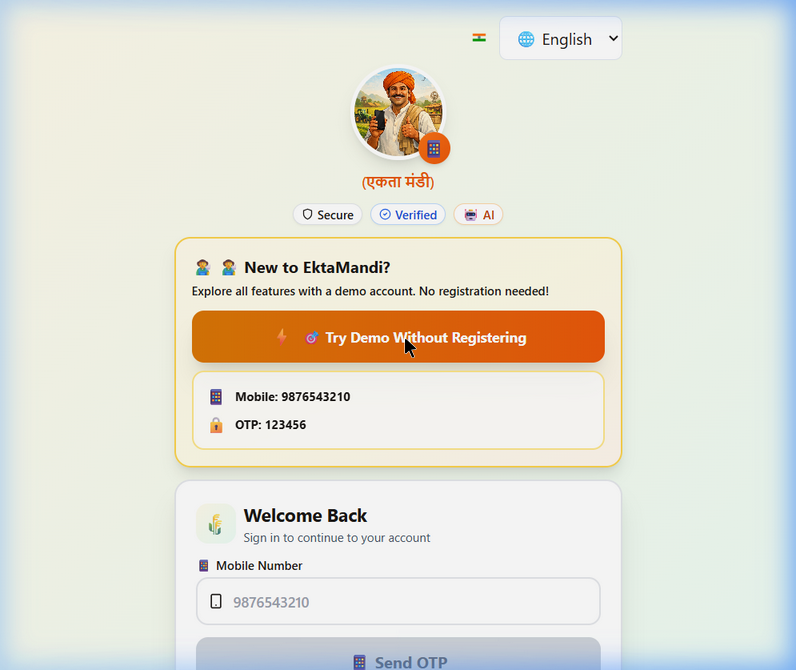
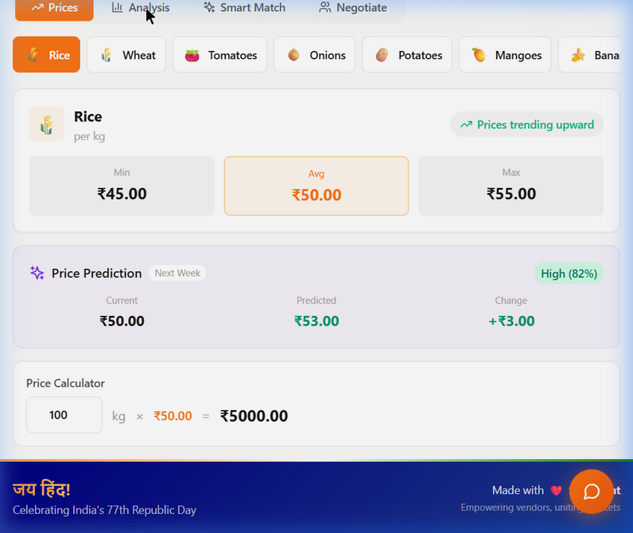
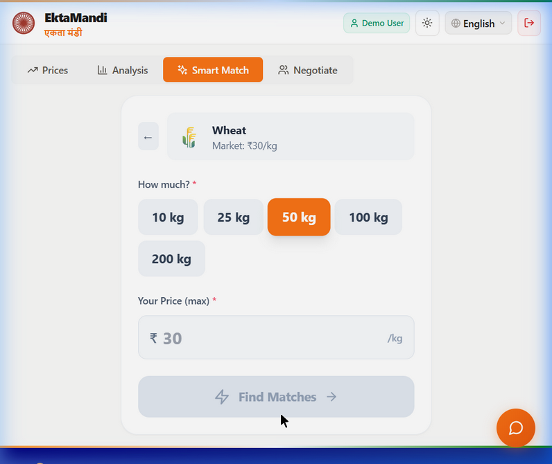
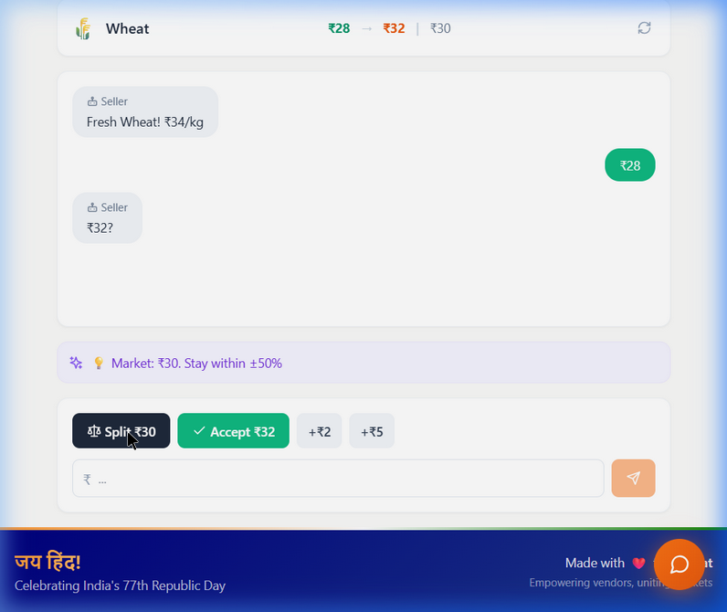

# Ekta Mandi - 3-Minute Demo Video Script

**Target Duration:** ~3 Minutes
**Pacing:** Deliberate, clear, and engaging. Pause naturally between sentences.
**Visuals:** Recorded screen capture of https://main.d166zztz4o883k.amplifyapp.com/

---

## Part 1: The Problem & Introduction (0:00 - 0:45)

**[Visual: Start on the Ekta Mandi Homepage. Scroll slowly through the value propositions: "Secure", "Verified Players", "AI Powered".]**

**Narrator:**
"Welcome to Ekta Mandi—Unity in Diversity, Prosperity in Trade. 

For decades, the agricultural supply chain in rural India has been plagued by a massive lack of transparency. Farmers harvest their crops, but when it's time to sell, they are entirely at the mercy of local middlemen. They don't know the true market rate, they don't have direct access to buyers, and the bargaining process is heavily skewed against them.

We built Ekta Mandi to solve exactly this. It’s a comprehensive digital platform designed to completely eliminate market opacity, directly connect verified buyers and sellers, and use artificial intelligence to ensure everyone gets a fair deal."

## Part 2: Transparent Pricing & Predictive Analysis (0:45 - 1:30)

**[Visual: Click on 'Try Demo'. Navigate to the 'Prices' tab. Scroll slowly through the list of crops (Rice, Wheat, etc.). Click on the 'Analysis' tab and hover over the charts showing 'Price Volatility' and 'Predictive Forecasts'.]**

**Narrator:**
"Let's look at how it works. Our first pillar is absolute pricing transparency. 

In the 'Prices' section, farmers can instantly view real-time, verified market rates for their specific crops across different regions. They instantly know what their harvest is worth today.

But we go a step further. Under the 'Analysis' dashboard, we use historical data and market trends to provide simple, actionable intelligence. Our system offers 6-month predictive forecasts, showing farmers not just what the price is now, but whether they should hold their crop for a better return next month. It turns complex market data into clear, accessible advice."

## Part 3: Smart Match & Direct Connection (1:30 - 2:15)

**[Visual: Navigate to the 'Smart Match' tab. Select 'Buy Goods'. Choose 'Wheat' from the dropdown and type in '50 kg'. Hit 'Find Matches'. Scroll through the results showing nearby farmers/vendors.]**

**Narrator:**
"Our second pillar is connection. The traditional way of finding a buyer or a bulk seller relies entirely on word of mouth. 

Ekta Mandi introduces the 'Smart Match' feature. Whether you are a vendor looking to buy 50 kilograms of wheat, or a farmer looking to offload 5 tons of rice, our platform instantly pairs you with localized, verified matches. 

No more searching blindly. It connects supply and demand instantly, cutting out unnecessary intermediaries and ensuring that farmers sell faster, and buyers find exactly what they need."

## Part 4: AI Negotiation & Accessibility (2:15 - 3:00)

**[Visual: Navigate to the 'Negotiate' tab. Select 'Buyer'. Choose 'Wheat'. Begin interacting with the AI chat. Type in a price, then select the 'Split' option to reach an agreement. Finally, hover over or click the 'Voice Assistant' button on the screen.]**

**Narrator:**
"Finally, there is the bargaining itself. Traditional negotiation can be intimidating and unfair.

We developed an industry-first AI-Powered Negotiation engine. Buyers and sellers can negotiate securely in our digital environment. The AI acts as a mediator, suggesting fair compromises—like splitting the difference—so both parties reach a mutual, profitable consensus without the friction.

And to ensure this technology actually reaches rural India, the platform features a multilingual Voice Assistant. Users who may not be completely tech-savvy can simply speak to the app—whether in Hindi or English—to check prices or make deals.

Ekta Mandi isn't just an app. It's the secure, intelligent, and transparent future of agricultural trade in Bharat."
